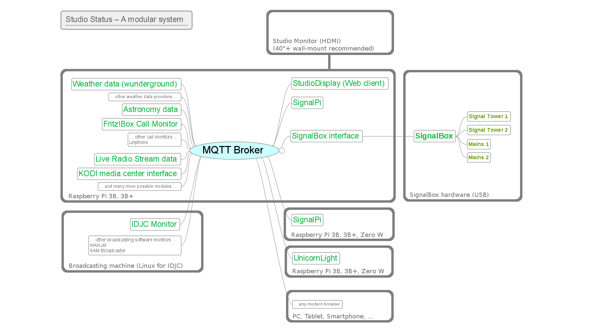
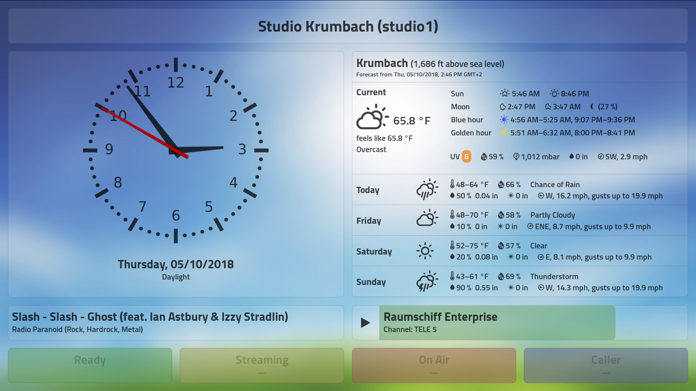

# Architecture

StudioStatus was created because we wanted to replace our old-fashioned LED-type studio clock with something more modern, like a 40" display on the wall.

It should show information most critical to the studio personnel and radio announcer and be modular, fast, and reliable. And it should be able to enhance the function of our signal towers. Plus, drive a mains-switched "ON AIR" sign outside the studio.

So we sat together, made a concept and started building. It’s not yet perfect and undergoes some modifications, at times. But it’s already a robust, fast, and versatile system we use everyday.

Made by radio professionals for radio professionals. Free and Open Source Software that you can use and even improve by contributing.

We mainly use Linux, but we build with standard components like MQTT, Python, Javascript and the IOWarrior IOWKit, so StudioStatus should easily be adaptable to work with Windows and MacOS, too.

## Configuration and restrictions

You usually have _one_ central MQTT broker that can be thought of as the "central message bus".

* Each device (or software module) must have a _unique client ID_ (per broker), so each device/module (on whatever machine) can be uniquely identified. I usually recommend using »speaking names« like `weather1` and also put the "id" number into the topic, like `weather/1/`.

  The only devices that do not use a client id are web clients: Web pages only _read_ data from the MQTT bus, and you can have any number of browsers accessing the page. Thus we don’t really need a unique id (but the MQTT broker will still assign one internally).

  _Note: If you accidentally use the same client id for two devices, they will start "fighting" for the connection. If two devices start reconnecting every few seconds, this is typically the reason._

* All devices/modules running on the same machine (hostname) use _the same configuration file_ and read their configuration from their [section] in the configuration file. This means you can have _many different modules_ running on the same machine, but _only one of the same type_ (i.e., one SignalPi).

  Configuration files are in the `~/studiodisplay/config/` folder and named after the machine’s _hostname_, i.e. `studiodisplay1.cfg` or `studio1.cfg` Each module first determines the hostname it’s running on, then tries to open the corresponding configuration file. It will then read the `[mqtt]` section for information on how to reach its MQTT broker and finally read all other configuration _for this module on this machine_ from its own section, i.e. `[weather-wunderground]`.

  *Note: If a correct configuration file cannot be found, there is a built-in fallback to read an "emergency configuration" from `unknown_host.cfg`.*

* You can have _many devices/modules of the same type_ (like weather providers, IDJC monitors, SignalBoxes, …), provided _they run on separate machines_ (i.e., every StudioDisplay and every SignalPi gets its own Pi).

## Basic signalling

There are some basic assumptions about the signalling, which are used throughout the system (but might be changed):

### White light (optional)

Mode | Meaning
--- | ---
Off | This studio can currently not be used.
On | Basically »Studio operable«, i.e. Power on, systems connected, Internet access.

### Green light

Mode | Meaning
--- | ---
Off | Basically »Studio not ready«, i.e. broadcasting software not ready (i,e., mAirList, IDJC, …)
On | Basically »Studio ready«, i.e. broadcasting software ready (mAirList, IDJC, … started and ready to operate)
Flashing | **Attention!** Problem with the broadcasting software (i.e., IDJC frozen)

### Yellow/orange light

Mode | Meaning
--- | ---
Off | Not broadcasting (i.e., not streaming, not outputting to FM)
On | All (watched) outputs are broadcasting (i.e., all streams/FM transmitters up)
Blinking | Not all (watched) outputs up & running (i.e., not all streams/FM transmitters up)
Flashing | **Attention!** Silence detected on stream (typically more than 5s with less than -40 dB). _In a future version, this might be accompanied by one or more »beeps« on the PFL and alarm channels._

### Red light / Monitor Mute

Mode | Meaning
--- | ---
Off | No microphone currently open
On | **Silence!** At least *one* microphone is open, the announcer (and/or guest/caller) is talking. StudioDisplay will show which microphones are open. _The studio monitor speakers will be automatically muted in this state._
Blinking | **Overtime!** At least one microphone is open, but the announcer already talks longer than the pre-programmed time for a fixed-length element.
Flashing | **Attention!** An EOM (End-of-Medium) signal has been fired, announcement due in less than 10 seconds, or the playlist is ending. _This will be accompanied by a »beep« on the PFL and alarm channels._

### Blue light (optional)

Mode | Meaning
--- | ---
Off | No caller(s) on the request/talk line(s).
Flashing | Request/talk line(s) ringing, somebody calls. StudioDisplay will show the caller’s phonenumber, if he has caller id enabled.
Blinking | Call connected and waiting. The announcer might talk to the caller off-air. (Red phone in IDJC.)
On | Caller on-air (usually together with the announcer and/or studio guests). (Green phone in IDJC.)

---

_TODO: Finish this section_

## Web Client

This is a software module that essentially builds a web page which can be used in the local LAN on almost any device that has a modern browser.

Our real StudioDisplay is a 42" wallmounted screen driven by a Raspberry Pi 3B running [FullPageOS](https://github.com/guysoft/FullPageOS).

The web client is fully localizable via *gettext*-like JSON language files in the config folder. Background images change automatically, calculated from the lighting conditions at your location. They can even be exchanged against your own. Here is a sample in both German (de-DE) and American English (en-US) at around 3 p.m.—as you see, even the measurement units are converted automatically!

*German (de-DE) — localized dates & times, temperatures in °C, speed in km/h, KODI playing TV channel*

*English, United States (en-US) — localized dates & times, temperatures in °F, speed in mph, KODI playing TV channel*

At night in Great Britain: Colors and background image have automatically changed. The studio is ready and streaming on stream #4. Currently the presenter and a studio guest are on air (microphones #1 & #2 are open). The live title data from the actual stream is shown below the clock. KODI plays a TV show but is currently paused (timeshift).

Plus, the real signal tower in the studio (connected to a SignalBox via USB) displays exactly the same green, yellow, red and blue lights as shown on the StudioDisplay screen.

*At Night: English, Great Britain (en-GB) — something going on in the studio*

Requirements:

* A web server (in a local, unsecured environment, this can even be Python’s built-in: `python3 -m http.server 8082`).

* A display device running a modern browser (Firefox, Chromium, Chrome, …). We do use lots of the latest features like CSS3 grid, ES2016 Javascript, the fetch interface, and so on. This can be almost anything ranging from a smartphone up to a 100" screen.

  We use a 42" wallmounted screen driven by a Raspberry PI 3B running [FullPageOS](https://github.com/guysoft/FullPageOS). This gives us perfect »at-a-glance« readability in the studio. (And, besides, can be used as a TV/KODI monitor.)

* The `index.html` and all files in the `config`, `css`, `font`, `images` and `js` folders.

*Note: Topic names are configurable in the configuration file. The topic names shown below are just the defaults. Almost ANY (Javascript-supported) language can be used by providing an appropriate language file in the config folder. **PLEASE HELP and send your translation file via GitHub!***

*Note: The client will automatically try to reconnect (with increasing delay, up to 2 minutes) if for some reason the connection to the MQTT broker fails.*

### Subscribes to

Topic | Usage
--- | ---
studio/status/# | Indicators (Ready, Streaming, On Air, Caller)
radio/status/# | Stream Data from Icecast or Shoutcast
weather/xxx/status/# | Local weather data, 3-day forecast

### Publishes

Topic | Usage
--- | ---
studiodisplay/connected | Connection status

### Commands

Topic | Usage
--- | ---
studiodisplay/command/reload | reload page with new configuration

### Configuration file

#### `[mqtt]` section:

Parameter | Meaning | Default
--- | --- | ---
host | MQTT broker host name | studio
websockets_port | MQTT broker port for web sockets | 9001

#### `[webclient]` section:

Parameter | Meaning | Default
--- | --- | ---
client_id | (unique) ID of this webclient; leave this empty so the broker can hand out unique IDs for each web client! | (empty)
title | Title of the web page. | StudioDisplay
command_topic | topic for commands sent to this device | studiodisplay/command/
reconnect_timeout | Timeout for initial connection to broker, in ms. | 2000
reconnect | Use progressive reconnect feature in case the display loses connection to the broker. | true
weather_topic | Read weather data from this topic. | weather/status/
indicator_topic | Read indicator (lamp) data from this topic. | studio/status/
radio_topic | Read live radio stream data from this topic | radio/status/
kodi_topic | Read KODI mediaplayer status data from here. | kodi/status/
latitude | Your studio’s latitude. Needed for calculation of various phases of the day (and background image changes). | x.xxxxxxx
longitude | Your studio’s longitude. Needed for calculation of various phases of the day (and background image changes). | x.xxxxxxx
locale | (Javascript-compatible) locale code for your location. A corresponding language file must be available in the `config` folder. Allows for full localization. | en-GB

## SignalBox (signal tower interface)

This is a combined hardware/software module. It consists of:

* A physical SignalBox device with an attached signalling tower, connected via USB. It can drive up to two 24V signal towers (like WERMA, PATLITE, Eaton, …) with 5 and 3 lamp units attached, respectively. It also features two mains outlets (230V) to control a mains-operated ON-AIR light and one extra independent device.

* The Python software modules `mqtt-signalbox.py` and `signalbox.py`.

*Note: The client id and many topic names are configurable in the configuration file. The topic names shown below are just the defaults.*

*Note: The client will try stay alive as good as possible but will currently __not__ survive disconnecting the USB to the SignalBox.*

### Subscribes to

Topic | Usage | Values
--- | --- | ---
studio/status/green | Studio (i.e., IDJC) ready | off, blink, on
studio/status/yellow | Streaming/Broadcasting | off, blink, on
studio/status/red | On Air (microphone(s) open) | off, flash, blink, on
studio/status/blue | Caller | off, flash, blink, on
studio/status/white | (used internally by SignalBox) | off, on
studio/status/switch | (alternative to signalbox/set/switch) | off, on
studio/status/all | (for testing only) | off, flash, blink, on

### Publishes

Topic | Usage | Values
--- | --- | ---
signalbox/connected | Connection status | 0, 1, 2

### Settings

Topic | Usage | Values
--- | --- | ---
signalbox/set/switch | switches extra mains outlet (flash/blink not allowed for safety reasons) | on, off

### Commands

None.

### Configuration file

#### `[mqtt]` section:

Parameter | Meaning | Default
--- | --- | ---
host | MQTT broker host name | studio
port | MQTT broker port | 1883

#### `[signalbox]` section:

Parameter | Meaning | Default
--- | --- | ---
client_id | (unique) ID of this signalbox | signalbox
subscribe_topic | Topic to watch for indicators (lamps) | studio/status/
publish_topic | Topic to publish own statuses to. | signalbox/status/
config_topic | Here we receive settings like signalbox/set/switch:on. | signalbox/set/
switch | Initial state of the switch for the switchable mains socket. For safety reasons, this will **not** accept *blink* or *flash*. | off

## Fritz!Box call monitor

This is a software module that interfaces with the AVM Fritz!Box routers to inform the studio personnel about incoming calls. For convenience, it can also notify and pause/resume a running KODI mediaplayer instance.

Requirements:

* An AVM Fritz!Box router with activated callmonitor feature. (Most models have this, dial #96\*5\* from a local phone to activate, #96\*4\* to deactivate.)

* The Python software modules `mqtt-callmonitor-fritz.py` and `call_monitor.py`.

*Note: The client id and many topic names are configurable in the configuration file. The topic names shown below are just the defaults.*

### Subscribes to

The Fritz!Box call monitor, for the phone numbers configured in the configuration file or via the `callmonitor/set/phonenumbers` topic.

### Publishes

Topic | Usage | Values
--- | --- | ---
callmonitor/connected | Connection status | 0, 1, 2
studio/status/blue | Call indicator (blue lamp) | off, flash, blink
studio/status/phonenumber | Caller’s phone number | phone number
kodi/command/notify | Call status notification for KODI | title, message (JSON)
kodi/command/playbackstate | Pause/resume KODI playback | pause, resume

### Settings

Topic | Usage | Values
--- | --- | ---
callmonitor/set/phonenumbers | sets phonenumber(s) to watch (incoming caller request line) | comma-separated list of phone numbers
callmonitor/set/kodi | Enable/disable KODI notifications | true, false

### Commands

None.

### Configuration file

#### `[mqtt]` section:

Parameter | Meaning | Default
--- | --- | ---
host | MQTT broker host name | studio
port | MQTT broker port | 1883

#### `[callmonitor-fritz]` section:

Parameter | Meaning | Default
--- | --- | ---
client_id | (unique) ID of this callmonitor; also used as the base for the config_topic | callmonitor
publish_topic | The topic where the blue lamp status and caller’s phonenumber are published to. | studio/status/
config_topic | The topic where call monitor receives its settings. | callmonitor/set/
kodi | Interact with a KODI mediaplayer? | true
kodi_command_topic | The topic where KODI receives its commands. | kodi/command/
phonenumbers | Comma-separated list of phonenumbers (request lines) to watch. | (empty)
locale | Locale for KODI, allows for translation of call notifications. | de-DE
