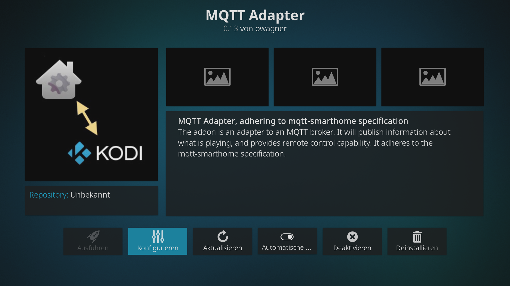
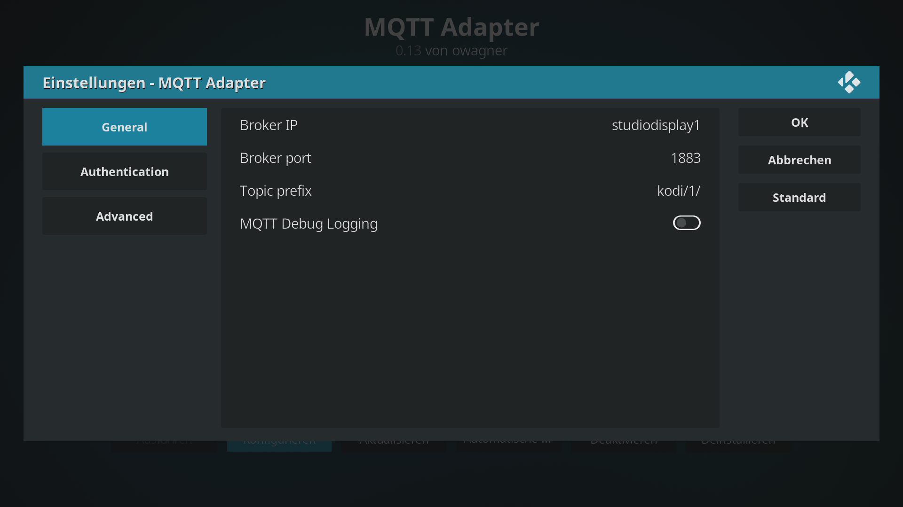
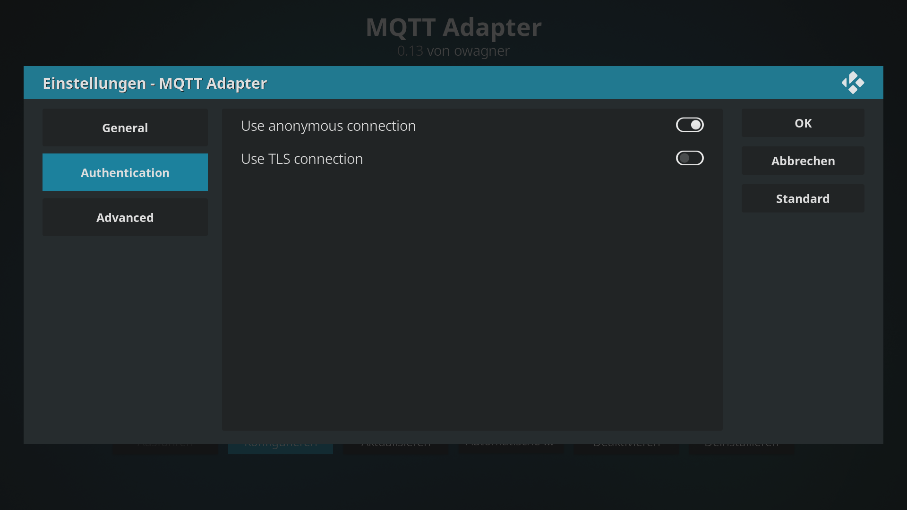
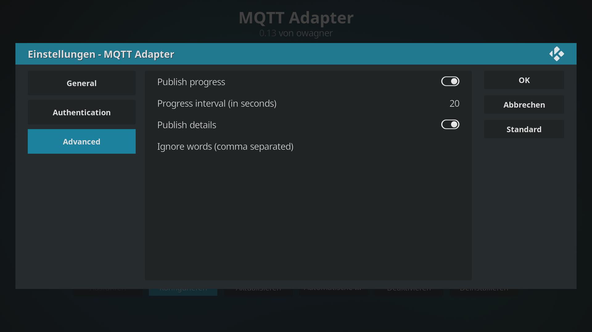
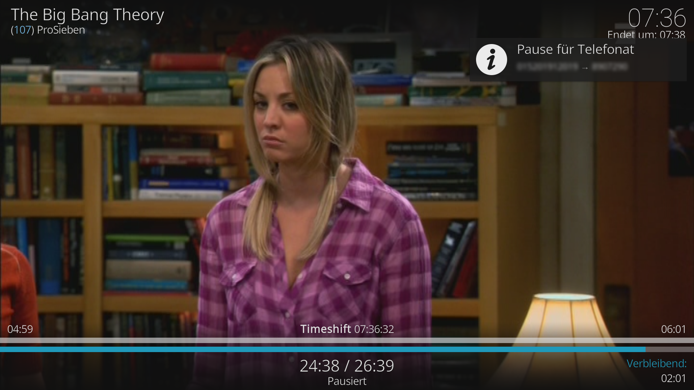
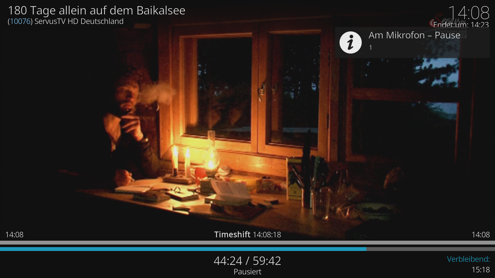
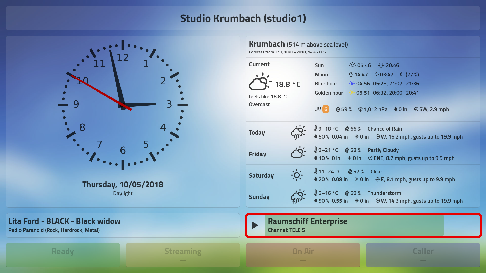

# Integrating a KODI media center (OpenELEC, LibreELEC) with StudioDisplay

Imagine you use a KODI media center in the studio, maybe to keep up on the news or soccer results. You also have listener request lines open and need to talk to callers without missing anything.

So of course you want KODI not only to pause when any microphone goes live, but also while you’re on the phone. Ideally, it should also timeshift live TV, because you can’t afford to miss anything.

No worries. StudioDisplay does all this—and more—for you.

## Table of Contents

<!-- MDTOC maxdepth:6 firsth1:2 numbering:0 flatten:0 bullets:1 updateOnSave:1 -->

- [Table of Contents](#table-of-contents)   
- [Install `kodi2mqtt` on your KODI](#install-kodi2mqtt-on-your-kodi)   
- [Set up the call monitor to interact with KODI](#set-up-the-call-monitor-to-interact-with-kodi)   
- [Set up the IDJC monitor to interact with KODI](#set-up-the-idjc-monitor-to-interact-with-kodi)   
- [Show KODI status on the StudioDisplay](#show-kodi-status-on-the-studiodisplay)   

<!-- /MDTOC -->

## Install `kodi2mqtt` on your KODI

You can install [owagner’s kodi2mqtt plugin](https://github.com/owagner/kodi2mqtt) on your KODI and have the StudioDisplay system interact with it. Call notifications will be shown on the TV, and playback paused while you’re on the phone or any microphones are live.

It can even timeshift your TV so you won’t miss a second!

Assuming you have installed the above on your KODI, set it up as follows:









*Note:* The MQTT Adapter for KODI isn’t perfect. It doesn’t always do title updates, and it loses connection when you reboot your StudioDisplay Pi. You can usually make it reconnect by going into its configuration (on KODI) and selecting the OK button.

If something doesn’t work, hop over to Github and open an issue there—this is not my software: [https://github.com/owagner/kodi2mqtt/issues](https://github.com/owagner/kodi2mqtt/issues).


## Set up the call monitor to interact with KODI

This will show a notification and pause your KODI whenever a phone call is active.

On your `studiodisplay1` machine, set up the call monitor to use KODI.

Use `ssh` to connect to it and edit its configuration file:

```bash
ssh pi@studiodisplay1
cd ~/studiodisplay/config/
nano studiodisplay1.cfg
```

Look up the `[callmonitor-fritz]` section and set it up:

```ini
[callmonitor-fritz]
…
; Interact with KODI (i.e. pause/resume on connected call)?
kodi = True
; Set "Topic prefix" in your KODI’s MQTT Adapter accordingly, i.e. "kodi/1/"!
kodi_command_topic = kodi/1/command/
…
; For translation of notification texts to KODI.
locale = de-DE
```

Save and exit, then restart `mqtt-callmonitor-fritz.py` (or simply reboot the machine with `sudo reboot`).

This is how it looks on my (German-language) KODI when I accept a phone call:

  
*KODI pausing and timeshifting TV while you’re on the phone*


## Set up the IDJC monitor to interact with KODI

This will show a notification and pause your KODI whenever a microphone goes live.

On your IDJC machine (`studio1` in our example), set up the IDJC monitor to use KODI.

Edit its configuration file:

```bash
cd ~/studiodisplay/config/
nano studio1.cfg
```

Locate the `[idjc]` section and set it up:

```ini
[idjc]
…
; Interact with KODI (i.e. pause/resume on microphone open)?
kodi = True
; Set "Topic prefix" in your KODI’s MQTT Adapter accordingly, i.e. "kodi/1/"!
kodi_command_topic = kodi/1/command/
; For translation of notification texts to KODI.
locale = de-DE
…
```

Save and exit, then restart `mqtt-idjc.py` (or simply reboot or log off and on again).

This is how it looks on my (German-language) KODI when I open microphone #1:

  
*KODI pausing and timeshifting TV while microphone #1 is live*


## Show KODI status on the StudioDisplay

StudioDisplay will show what’s playing on KODI and display some information about it. It even has a progress indicator.

On your `studiodisplay1` machine, set up the web client to use KODI.

Use `ssh` to connect to it and edit its configuration file:

```bash
ssh pi@studiodisplay1
cd ~/studiodisplay/config/
nano studiodisplay1.cfg
```

Look up the `[webclient]` section and set it up:

```ini
[webclient]
…
kodi_topic = kodi/1/status/
…
```

Save and exit, then restart the web client. Simply use `F5` or `Ctrl+F5` on a browser, or reload all displays with a MQTT command:

```bash
mosquitto_pub -h studiodisplay1 -t studiodisplay/all/command/reload -n
```

This is how it looks on my StudioDisplay when I use KODI to watch »Raumschiff Enterprise« (Star Trek TOS, episode almost finished) on TV channel »TELE 5«:

  
*KODI status on the StudioDisplay. The »playing« icon can change to »paused« and »stopped«.*
