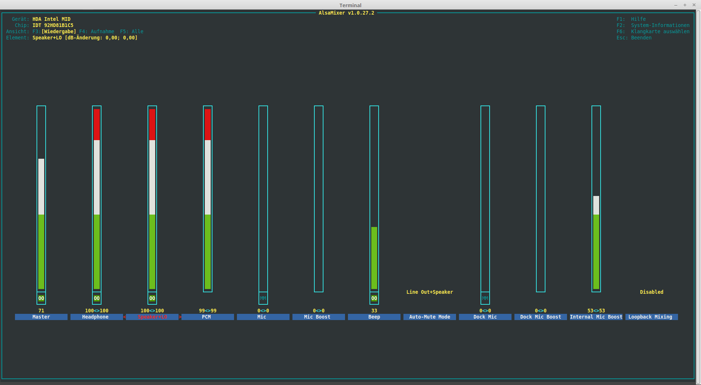
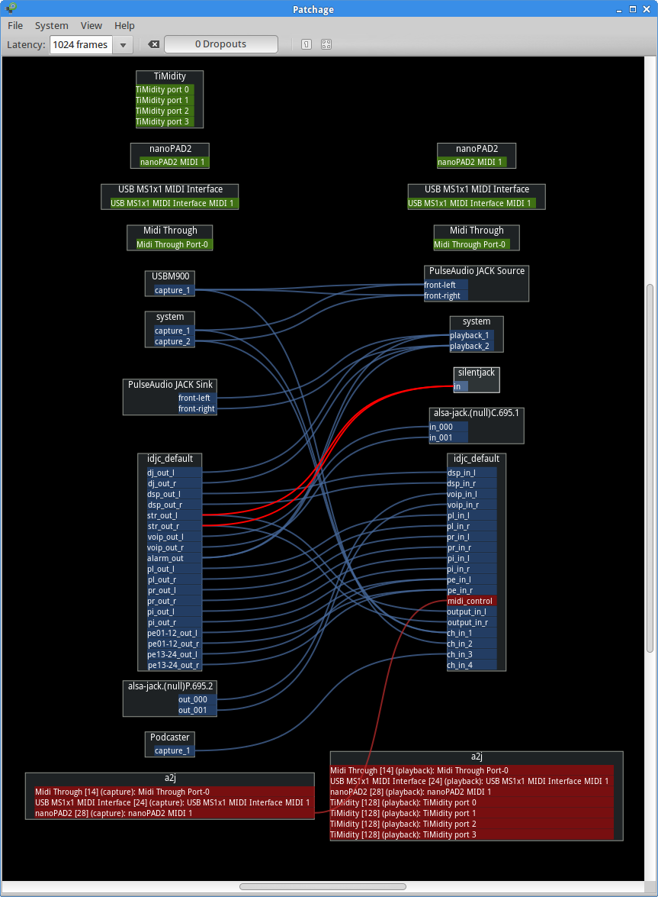
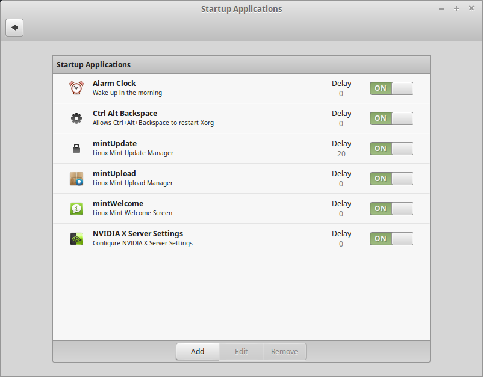
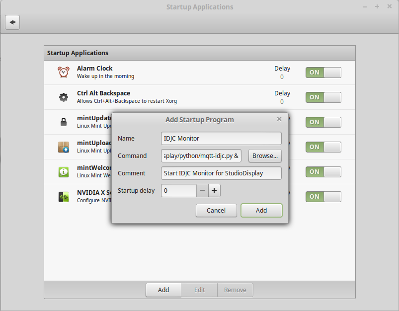
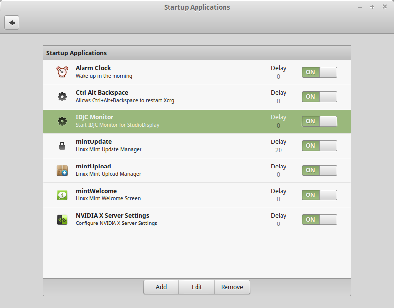

# Installing the IDJC (Internet DJ Console) Monitor

IDJC, the Internet DJ Console, is a professional and very robust broadcasting software for Linux.

You should be using version 0.8.16 or above. Install from your distro’s repositories or compile and build yourself.
Announcement overtime signalling works on version 0.8.18_development and above.

We interface to IDJC using the provided idjcmonitor, handle changes and set states on the MQTT message bus.

**You *must* use this module on the machine(s) you’re running IDJC on!** Also, the corresponding configuration file must be named after the hostname of your IDJC machine. This allows for having more than one machine running IDJC, with different client ids. (Plus, we cannot remotely read the Dbus of your broadcasting machine.)

## Table of Contens

<!-- MDTOC maxdepth:5 firsth1:2 numbering:0 flatten:0 bullets:1 updateOnSave:1 -->

- [Table of Contens](#table-of-contens)   
- [Configuration file](#configuration-file)   
- [Installation](#installation)   
   - [Mute studio monitor speakers](#mute-studio-monitor-speakers)   
      - [Hints for using `amixer scontents`](#hints-for-using-amixer-scontents)   
      - [Using `alsamixer` for testing](#using-alsamixer-for-testing)   
   - [Silence detection](#silence-detection)   
   - [IDJC monitor](#idjc-monitor)   
   - [Testing basic functionality](#testing-basic-functionality)   
   - [Autstarting the IDJC Monitor](#autstarting-the-idjc-monitor)   
      - [Crontab method (might not work on all systems)](#crontab-method-might-not-work-on-all-systems)   
      - [Using your desktop’s autostart method (recommended)](#using-your-desktop’s-autostart-method-recommended)   
         - [Example: Autostart on Linux Mint with the »Cinnamon« desktop](#example-autostart-on-linux-mint-with-the-»cinnamon«-desktop)   

<!-- /MDTOC -->

## Configuration file

Let’s assume your broadcasting software (IDJC) runs on a system called `studio1`. This is normally *not* your SignalDisplay Pi! For reasons of simplicity, let’s assume you have installed the software in the same location, i.e. in your home directory in the folder `~/studiodisplay/`.

You can set/modify all relevant options in the `[idjc]` section of your config file *on the `studio1` machine*:

```bash
nano ~/studiodisplay/config/studio1.cfg
```

The `[idjc]` section looks like this:

```ini
[idjc]
client_id = idjc1
; connected, status/, get/, set/, command/ are internally appended to client_topic
; format: device/id/ (id CAN be something else than a number)
client_topic = studio/1/
; Interact with KODI (i.e. pause/resume on microphone open)?
kodi = True
; Set "Topic prefix" in your KODI’s MQTT Adapter accordingly, i.e. "kodi/1/"!
kodi_command_topic = kodi/1/command/
; IDJC profile to watch
profile = default
; IDJC streams to watch (not all streams up makes YELLOW blink)
streams = 1,2
; IDJC channels to watch (usually microphones but may also be line-ins)
; example: Presenter, Studio guest
channels = 1,2
; Overtime: Set this to a nonzero value (seconds) if the RED light should
; start blinking to signal overtime when talking (often used: 60-120 s).
; Zero means only blink RED when a timed announcement (in the playlist) goes into overtime.
overtime = 60
; We can use silentjack for silence detection:
;   sudo apt-get install silentjack
; Connect BOTH IDJC’s "str_out_l" and "str_out_r" to silentjack
; using Patchage or qjackctl, since silentjack can only handle 1 connection itself.
silence_detection = True
silence_detection_db = -40
silence_detection_seconds = 5
; We can execute a command when IDJC starts/stops.
; This is mainly used to set up various audio setups for broadcasting.
; Upon startup, set Auto-Mute off, so we can use both headphones and speakers
idjc_launch_command = amixer sset "Auto-Mute Mode" Disabled
; Upon closing, set it back so the speakers get disabled when a headphone is connected.
idjc_quit_command = amixer sset "Auto-Mute Mode" "Line Out+Speaker"
; We can mute/unmute monitor speakers when a microphone is opened/closed.
; Typically, this is done (for ALSA) using a "amixer" command.
; You will probably have to set "Auto Mute Mode" to "Disabled" in alamixer
; for this to work with both speakers and headphones connected.
; Find out about your soundcard capabilites using "amixer scontents".
; The (shell) command to mute your monitor speakers, empty if none:
monitor_mute_command = amixer sset "Line Out" mute
; The (shell) command to unmute your monitor speakers, empty if none:
monitor_unmute_command = amixer sset "Line Out" unmute
```

Configure your IDJC and set here the profile, streams and channels to watch. The stream and channel numbers correspond directly to the numbers in IDJC’s GUI.

The web client will show stream and channel numbers in the yellow and red "buttons", respectively.

Be aware that you only get a steady yellow light when *all* of the selected streams are actually streaming! Otherwise, the yellow light will *blink* to indicate that not all streams are up.


## Installation

### Mute studio monitor speakers on open microphone

You usually have a set of studio monitor speakers so that you (and your guests) can follow the show. These must (an can) be muted immediately whenever any microphone in the studio goes live.

As described in the configuration file, you need to find out and try the correct `amixer` command to mute/unmute your studio monitor speakers, and enter these commands in the configuration above. Start with the defaults given in `example.cfg`, these work with many systems if you have the speakers connected to the _green_ output on the rear and the headphones on the green _front_ connector.

#### Hints for using `amixer scontents`

You can find the devices that are mutable (can be switched off) by looking for »Capabilities«. A mutable device always has the capability `pswitch`.

#### Using `alsamixer` for testing

You can try out the mute capabilities (and find the correct channels) using `alsamixer`. Mine looks as follows:



Select your audio card with `F6`, then select playback controls with `F3`. Select a channel using the arrow keys `←` and `→`. (I have currently selected »Speaker+LO«; my laptop has only one connection for speaker and line out.)

All _mutable_ playback controls have either a green `00` (open) or a blue `MM` (muted) at their bottom.You can select the channel and press the `m` key to mute/unmute it.

Volumes are controlled by using the `↑` and `↓` arrow keys, options (like for »Auto-Mute Mode«) are selcted using the `+` and `-` keys.

When you are done, hit the `Esc` key to exit the program. Your settings will be kept.


### Mute (pause) KODI media player on open microphone

You might use a KODI media player (OpenELEC, LibreELEC) in your studio, maybe to watch the news or a baseball game. Of course you’d wish to pause this, too, when any microphone is open!

Nothing easier than that: In the `[idjc]` section of your configuration file, specify KODI’s command topic and set `kodi` to `True`. Whenever any microphone goes live, the playback will be paused immediately (TV will even be timeshifted so you won’t miss a thing), and resumed again when all microphones are closed.

```ini
[idjc]
…
; Interact with KODI (i.e. pause/resume on microphone open)?
kodi = True
; Set "Topic prefix" in your KODI’s MQTT Adapter accordingly, i.e. "kodi/1/"!
kodi_command_topic = kodi/1/command/
…
```

We have enabled this feature per default, because it doen’t hurt if have no KODI. Read more about KODI integration in [docs/install-KODI.md](install-KODI.md).


### Silence detection

For a working silence detection, you currently need to install silentJACK *on the `studio1` machine*:

```bash
sudo apt-get install silentjack
```

Unfortunately, silentJACK can only connect to _one_ channel by itself. We try to connect it to the `str_out_l` of your IDJC, but it’s advisable to feed it _both_ the left _and_ right channels. You can do this using Patchage (which is also very helpful to connect all your JACK stuff, like microphones, etc.):

```bash
sudo apt-get install patchage
```

You’ll find Patchage in the »Multimedia« section of your menu.

Here’s my current configuration. It is a more complicated setup using 3 microphones, MIDI control and [Linphone](http://www.linphone.org/) for picking up request calls. Yours will probably look much simpler.

You might want to right-click the »idjc-default« block and select **Split** to get this display. I just find it a lttle more usable like this. The two connections to _silentJACK_ are marked in red.




### IDJC monitor

Let’s verify that all parameters and IDJC interaction work correctly.

Open a terminal and start the MQTT IDJC software *on the `studio1` machine*:

```bash
cd ~/studiodisplay/python/
./mqtt-idjc.py
```

It should show that a connection has been established, like this:

```
Read configuration from /home/matthias/studiodisplay/python/../config/studio1.cfg
Connecting to broker studiodisplay1:1883
Connected to broker studiodisplay1:1883
Subscribing to device config at studio/1/set/#
Subscribed with message ID 2 and QOS (0,) acknowledged by broker
```

Should you instead get a message like:

```
Traceback (most recent call last):
  File "./mqtt-idjc.py", line 25, in <module>
    import gobject
ImportError: No module named gobject
```
you might have to install `python-gobject` (at least on Ubuntu/Linux Mint):

```bash
sudo apt-get update
sudo apt-get install python-gobject
```

### Testing basic functionality

Start up IDJC with the profile (usually `default`) configured in the configuration file.

* On all signal towers connected to a SignalBox, on the SignalPi and on StudioDisplay (and connected browsers), the *green* light (studio ready) should light up.

Make a testing playlist, with a "player stop" or an "announcement" configured between titles.

Start streaming on one or more streams.

* On all signal towers connected to a SignalBox, on the SignalPi and on StudioDisplay (and connected browsers), the *yellow* light (streaming) should either *blink* or light up *steadily* (depending on whether you are streaming to *all* configured streams or not).

* SignalDisplay (and connected browsers) will additionally show the stream numbers that are currently up and running.

* When *at least one* stream is up, SignalPi and SignalBox will also show (and switch on) the 230V *ON AIR door light* outside the studio. This is usually a *red* light, so StudioPi shows it as such.

Open one ore more configured microphones (i.e., announcer and studio guest).

* On all signal towers connected to a SignalBox, on the SignalPi and on StudioDisplay (and connected browsers), the *red* light (on air) should turn *on* as soon as *at least one* microphone is open.

* SignalDisplay (and connected browsers) will additionally show the channel numbers (microphone numbers) that are currently open.

* The studio monitor speakers should automatically switch off as long as any microphone is open.

Wait until the song reaches about 9 seconds before the next "Player Stop" or "Announcement" (or end of playlist).

* Together with the acoustic warning (a beep), all red on-air lights (SignalPi, SignalBox with signal towers connected, StudioDisplay and browsers) should start *flashing*. This is a so-called End-of-Medium warning and means that a song is about to end and an announcement due.

If you have a real new version of IDJC (0.8.18+ development) and you have programmed an announcement with timing, you can also wait until the pre-programmed talk time runs out (i.e., the countdown goes below 00:00).

* In this case, all red on-air lights should start *blinking*. This is an indication that you’re talking overtime.

Try the *green phone* button (talk to caller off-air).

* The blue lights should be *blinking* (caller waiting, off-air).

Try the *red phone* button (take caller on-air, usually with announcer and guest microphones open).

* The blue lights should be lit *steadily* (caller on-air).

* Most probably, the red lights will also light up (microphone(s) open).

After all this testing, exit the Python module by pressing `Ctrl+C`.

### Autstarting the IDJC Monitor

The IDJC monitoring software module can work even when IDJC is *not* currently running. So you could use the ssame strategy we used on the Pi and start it automatically whenever your broadcasting machine starts up.

#### Crontab method (might not work on all systems)

As with the Raspberry Pi installation, let’s add an entry in *crontab* for your `studio1` machine:

```bash
crontab -e
```

Add (or edit) the entry like this (change the user name, mine is "matthias"):

```crontab
@reboot /home/matthias/studiodisplay/python/mqtt-idjc.py &
```

Assuming you use *nano* to edit your crontab, now press `Ctrl+O`, `Enter` and `Ctrl+X` to save and exit.

_Note: Instead of using a crontab entry, you can (and probably should) use whatever means your desktop environment offers for automatic program starting at login._

You can verify that everything works correctly by doing a reboot:

```bash
sudo reboot
```

#### Using your desktop’s autostart method (recommended)

This is a much more reliable way and that’s why we recommend it. With this method, the IDJC monitor will be automatically started whenever you logon to your broadcasting machine.

##### Example: Autostart on Linux Mint with the »Cinnamon« desktop

On Linux Mint with the Cinnamon Desktop Environment, simply open the **Menu**, click the **cogwheel button** to open **System Settings**, and select **Preferences → Startup Applications**.



Then click **Add**, select **Custom command** and fill in the following:

* Name: **IDJC Monitor**
* Command: **/home/matthias/studiodisplay/python/mqtt-idjc.py &**
  (Change the user name to _your_ username!)
* Comment: **Start the IDJC Monitor for StudioDisplay**
* Startup delay: You can usually leave this at zero → **0**



Click **Add** again and you will get a nice entry (that can even be switched on and off).



Close the Startup Applications dialog.

Your IDJC monitor will now be automatically started whenever you logon to your account.

You can try it out by logging off and back on again, starting your IDJC and performing the [Tests](#testing-basic-functionality) again.
