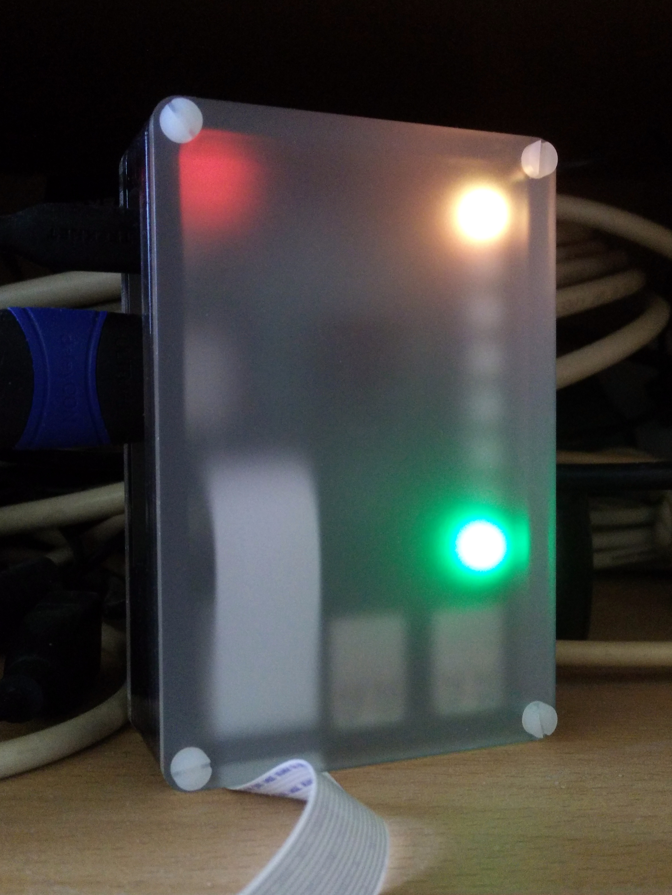
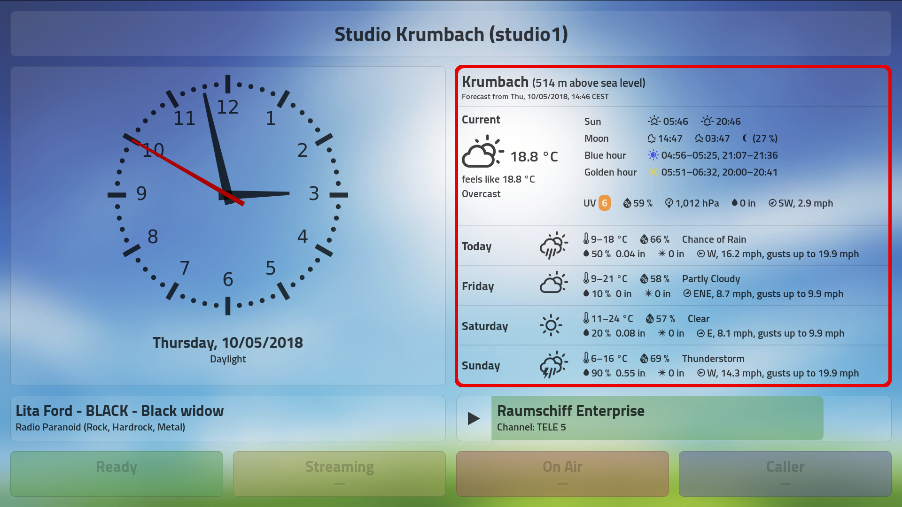
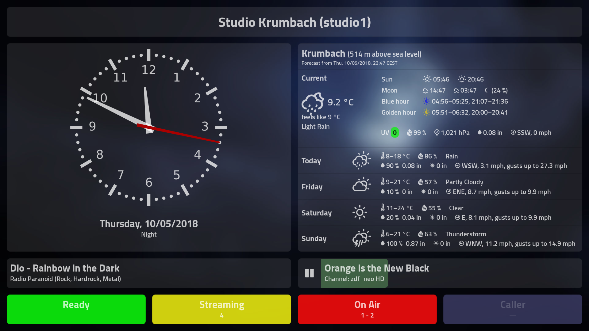
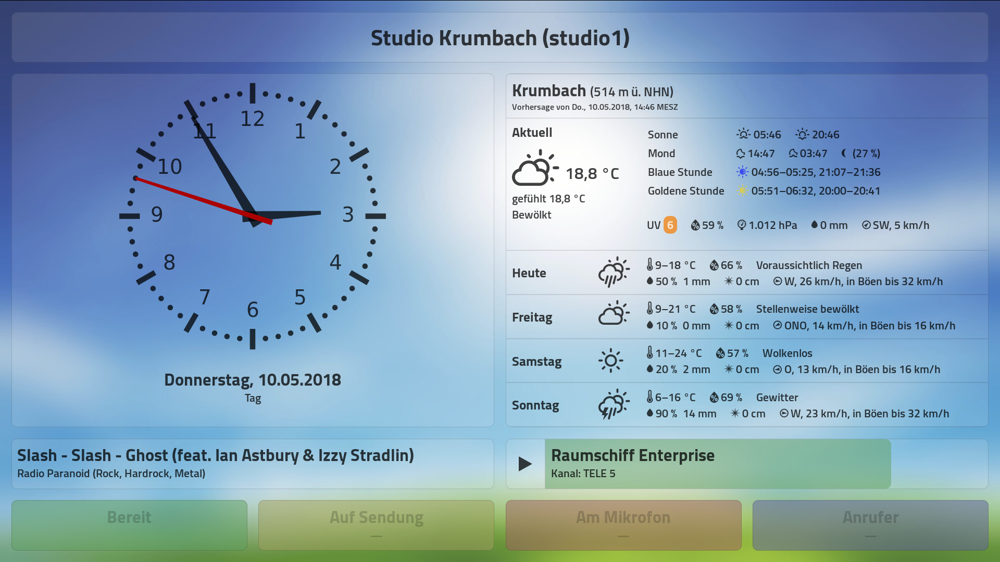
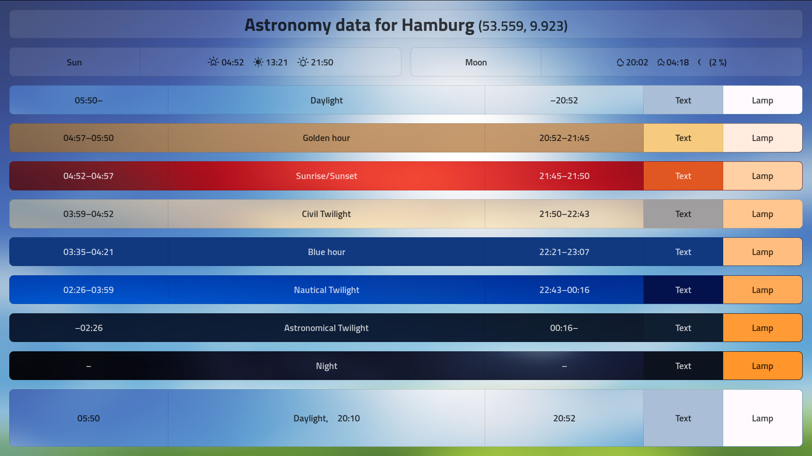
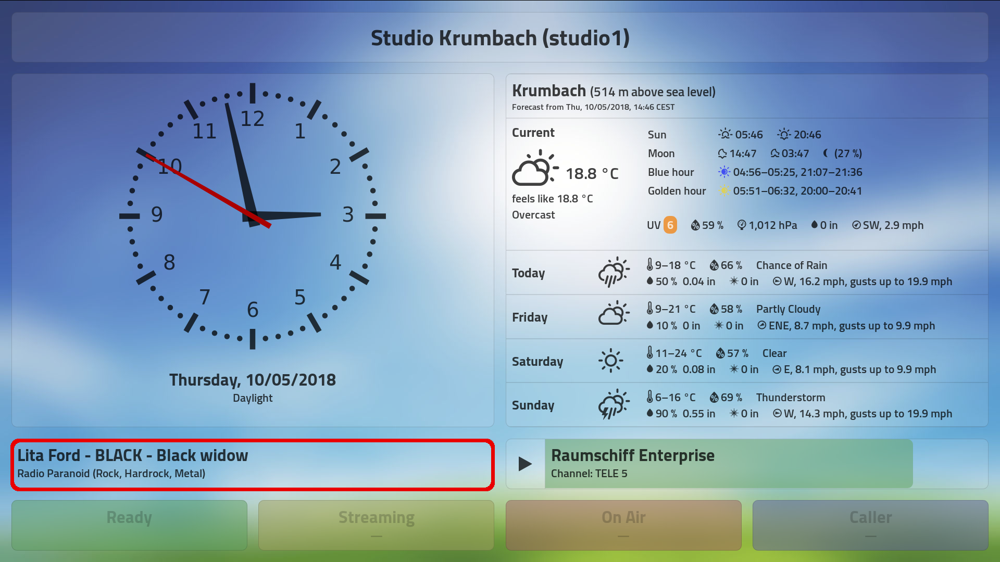
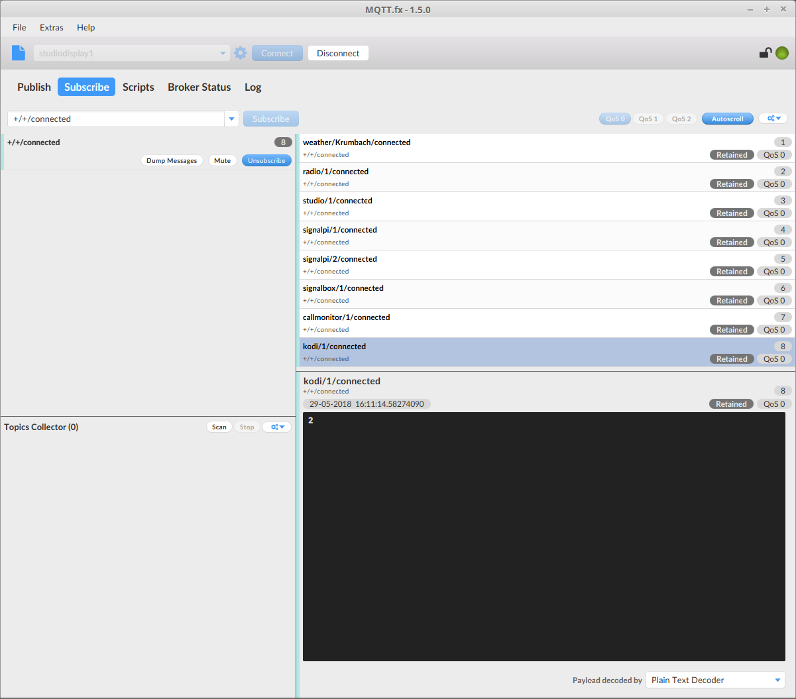
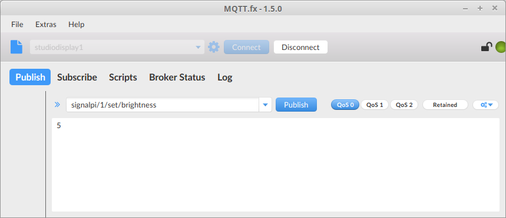
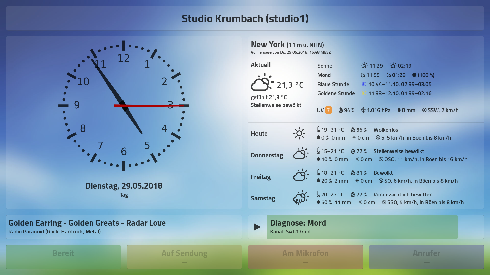

# Installation on the Raspberry Pi

  
*This little Raspberry Pi 3B does it all, with less than 10 W power consumption: MQTT broker; local web server; request line call monitor; KODI interface; live radio stream data; weather updates (Wunderground); drives a SignalBox (signal tower, door light, 230 VAC switch); runs SignalPi (status LEDs); drives a 42" StudioDisplay and even provides a live studio webcam stream (experimental)! It can be mounted somewhere in the studio (so you can see the LEDs) or secretly vanish behind the display. The network is connected by either WiFi or LAN.*

## Table of Contents

<!-- MDTOC maxdepth:6 firsth1:2 numbering:0 flatten:0 bullets:1 updateOnSave:1 -->

- [Table of Contents](#table-of-contents)   
- [Requirements](#requirements)   
- [Use `ssh` (or `PuTTY`) to connect to your Pi](#use-ssh-or-putty-to-connect-to-your-pi)   
- [Change the Pi’s hostname and passwords](#change-the-pi’s-hostname-and-passwords)   
   - [Change the hostname](#change-the-hostname)   
   - [Change the user password](#change-the-user-password)   
   - [Change the VNC password](#change-the-vnc-password)   
- [Copying the software](#copying-the-software)   
- [Update your Pi’s software](#update-your-pi’s-software)   
- [Install Python pip](#install-python-pip)   
- [Install the Python MQTT client software](#install-the-python-mqtt-client-software)   
- [Install the Mosquitto MQTT broker](#install-the-mosquitto-mqtt-broker)   
- [SignalPi — The poor man’s signal tower](#signalpi-—-the-poor-man’s-signal-tower)   
- [SignalBox](#signalbox)   
- [Local weather (from Weather Underground)](#local-weather-from-weather-underground)   
   - [Requirements](#requirements)   
   - [Configuration file](#configuration-file)   
   - [Installation](#installation)   
- [Web server and client](#web-server-and-client)   
   - [Requirements](#requirements)   
   - [Installation](#installation)   
   - [Configuration file](#configuration-file)   
- [Astronomy data (sunrise, sunset, phase of the day, …)](#astronomy-data-sunrise-sunset-phase-of-the-day-…)   
   - [Requirements](#requirements)   
   - [Configuration file](#configuration-file)   
   - [Installation](#installation)   
- [Live radio stream title display](#live-radio-stream-title-display)   
   - [Requirements](#requirements)   
   - [Configuration file](#configuration-file)   
   - [Installation](#installation)   
- [Fritz!Box call monitor for request lines](#fritzbox-call-monitor-for-request-lines)   
   - [Configuration file](#configuration-file)   
   - [Installation](#installation)   
      - [Testing a call](#testing-a-call)   
- [IDJC (Internet DJ Console) interface](#idjc-internet-dj-console-interface)   
- [Integrating a KODI media center (OpenELEC, LibreELEC) with StudioDisplay](#integrating-a-kodi-media-center-openelec-libreelec-with-studiodisplay)   
- [Let’s have some fun!](#let’s-have-some-fun)   
   - [Checking if all devices are connected and running](#checking-if-all-devices-are-connected-and-running)   
   - [Change the brightness of our SignalPis](#change-the-brightness-of-our-signalpis)   
   - [Let’s see what Radio Caroline plays (changing live radio stream to watch)](#let’s-see-what-radio-caroline-plays-changing-live-radio-stream-to-watch)   
   - [How’s the weather in New York City?](#how’s-the-weather-in-new-york-city)   
   - [Switch languages and locales](#switch-languages-and-locales)   
   - [Find out even more (and share)!](#find-out-even-more-and-share)   
- [You’ve done it!](#you’ve-done-it)   

<!-- /MDTOC -->

## Requirements

* A Raspberry Pi 3B or 3B+
* Installed and configured current version of [FullPageOS](https://github.com/guysoft/FullPageOS) (based on Raspbian Stretch)
* A feasible hostname, like `studiodisplay1` (set with `raspi-config`)
* Configured and working internet access (WLAN or LAN)


## Use `ssh` (or `PuTTY`) to connect to your Pi

If you are using a fresh installation of FullPageOS, connect to your Pi as follows:
```bash
ssh pi@fullpageos
```
(The default password is `raspberry`, you should change it using `raspi-config`!)

If you have already changed the hostname as suggested, use:
```bash
ssh pi@studiodisplay1
```
and enter your password when requested to do so.

_Note: Depending on your local network setup, you might have to use a FQDN (Fully Qualified Domain Name) instead of just the hostname. Simple cases might look like `studiodisplay1.local`, more complicated setups in large companies might even look like `studiodisplay1.hamburg.studios.bigbroadcastingcompany.com`. Ask your IT admin and just substitute the correct name in the examples._

On Linux, once a system has been set up, you can find its hostname in a terminal like this:

```bash
hostname
```

_Note: The name returned by the `hostname` command is also the name to be used for your StudioDisplay configuration file. So if your hostname was really `studiodisplay1.hamburg.studios.bigbroadcastingcompany.com`, you would have to call it `studiodisplay1.hamburg.studios.bigbroadcastingcompany.com.cfg` instead of just `studiodisplay1.cfg`._


## Change the Pi’s hostname and passwords

On a fresh installation of FullPageOS, your Pi will be found in your local network under the hostname `fullpageos` (you might need to use `fullpageos.local` for ssh and browser access).

SSH and a VNC server are enabled per default. (You could use an application like `vinagre` to access your Pi’s desktop screen.)

The default username is `pi` and the default password is `raspberry` (for both SSH and VNC). This is of course a security risk since everybody knows these.

We want to give our Pi a speaking name like `studiodisplay1` in the network (you might have more than one and call the next one `studiodisplay2`) and also change the default passwords to something more secure.

### Change the hostname

Log into your Pi using SSH. Since this is a fresh installation, the system name is still `fullpageos` and the user’s password is `raspberry`.

```bash
ssh pi@fullpageos
```

When connected, use `raspi-config` to change the hostname:

```bash
sudo raspi-config
```

*Note: raspi-config doesn’t support a mouse. You must use the keyboard. Jump between fields using `Tab` (forward) and `Shift+Tab` (backward). `Enter` selects/executes the marked option.*

* Select **2 Network Options** and press `Enter`.
* Select **N1 Hostname** and press `Enter`.
* Read the notice about allowed hostnames and press `Enter`.
* In the input field, change the hostname to **studiodisplay1** and press `Enter`.
* From the main screen, use the `Tab` key to select **Finish** and press `Enter`.
* When asked **Would you like to reboot now?**, select **Yes** and press `Enter`.

Your Pi will now reboot. Wait a while and then reconnect your SSH session, *using the new hostname `studiodisplay1`*:

```bash
ssh pi@studiodisplay1
```

After changing the hostname, the Chromium browser will usually complain about *"This profile seems to be in use by (old hostname) …"*, so we go and unlock it:

```bash
rm -f ~/.config/chromium/Singleton*
```

Chromium might already be running (it’s FullPageOS, after all), so we kill it. It should automatically restart and—hopefully—not complain anymore.

```bash
killall chromium-browser
```


### Change the user password

Now we go and change the password for the user `pi`:

```bash
passwd
```

You will have to legitimate using the *current* password (which is still `raspberry`) and then enter your *new* password twice.

*Note: On a console, your password input is never echoed, not even as dots or asterisks, so it is normal that you don’t see anything while you type your password.*

*Hint: For security reasons, passwords have to have a minimum length and complexity. If your password is too short or too simple, passwd will let you know.*

If all went well, you’ll get a message that your password has been changed. Remember it well or write it down in a secure place.

Let’s test if all went okay by logging out and back in again:

```bash
logout
ssh pi@studiodisplay1
```

*Hint: You can also log out from a terminal or SSH session by pressing `Ctrl+D`.*

Use your *new* password this time to log in.


### Change the VNC password

Your Pi can be accessed with an application called VNC (or Vinagre, for instance). This will allow a remote session to your Pi’s desktop.

The built-in VNC server uses its own password for this, which is also `raspberry` on a fresh installation.

We should also immeadiately change this password, maybe to the same you used for SSH access:

```bash
cd ~/scripts/
./setX11vncPass yournewpassword
```

At this point, you might want to use VNC, Vinagre, or another VNC viewer software on your system to check if you can access your Pi remotely using the new VNC password.


## Copying the software

Copy or `git clone` the software to your home folder on the Pi, into a folder named `studiodisplay`.

Example:
```bash
cd
git clone https://github.com/Moonbase59/studiodisplay.git
cd studiodisplay
```

Set up the configuration file `~/studiodisplay/config/studiodisplay1.cfg` (assuming your Pi’s hostname is `studiodisplay1`).

Make the Python modules in `~/studiodisplay/python` executable:
```bash
cd ~/studiodisplay/python/
chmod +x mqtt-*.py
chmod +x signaltest.py
```

You *must* have a configuration file set up in `~/studiodisplay/config/` that corresponds with your chosen hostname, i.e. `studiodisplay1`.

For starters, just copy and edit the example configuration file:
```bash
cd ~/studiodisplay/config/
cp example.cfg studiodisplay1.cfg
```
You can edit this file with `nano`, a very minimalistic commandline editor:
```bash
nano studiodisplay1.cfg
```
Changes are written with `Ctrl+O` and then pressing `Enter`. Exit nano with `Ctrl+X`.


## Update your Pi’s software

```bash
sudo apt-get update
sudo apt-get dist-upgrade
sudo rpi-update
```

Reboot as neccessary.


## Install Python pip

We might need to install `pip` and `pip3` before we can use it.

```bash
sudo apt-get install python-pip python3-pip
```

## Install the Python MQTT client software

We use Eclipse’s Paho client.

```bash
sudo pip install paho-mqtt
sudo pip3 install paho-mqtt
```

---

## Install the Mosquitto MQTT broker

```bash
sudo apt-get install mosquitto mosquitto-clients
```

For a simple running system without any security, create a mosquitto configuration file like this:

```bash
sudo nano /etc/mosquitto/conf.d/studiodisplay1.conf
```
*Hint: Name it after your Pi’s hostname and add `.conf` at the end*

For starters, it should contain this (minimal) configuration:

```
# default listener
port 1883

# websockets listener
listener 9001
protocol websockets
```

You can now save the file (`Ctrl+O`) and exit nano (`Ctrl+X`).

Restart the mosquitto server so that it will work with the new configuration:

```bash
sudo service mosquitto restart
```

You now have a running MQTT broker that is available in your local network under the address `studiodisplay1` and uses the standard ports `1883` and `9001` (for the web client, i.e. the HTML page).

You can test the installation by opening two terminal windows and typing the following:

In terminal 1, type:
```bash
mosquitto_sub -h studiodisplay1 -t test/#
```

In terminal 2, type:
```bash
mosquitto_pub -h studiodisplay1 -t test/message -m "Hello MQTT!"
```

You should see your message echoed on terminal 1!

In terminal 1, press `Ctrl+C` to abort. Then close both terminal windows again.

Perfect! Now edit the `[mqtt]` section of your config file, `~/studiodisplay/config/studiodisplay1.cfg`, to let the software modules know which broker to talk to:

```bash
nano ~/studiodisplay/config/studiodisplay1.cfg
```

The `[mqtt]` section should look like this:
```ini
[mqtt]
; ALL modules read from this section to find their broker connection data
; For simplicity and energy-saving, we run the MQTT broker
; on the first StudioDisplay (a Raspberry Pi 3B or 3B+).
host = studiodisplay1
port = 1883
websockets_port = 9001
; Base topic to distinguish different users, etc. Can be left empty.
base_topic =
```

---

## SignalPi — The poor man’s signal tower

  
*SignalPi on a Raspberry Pi 3B, very early development stage :-)*

  
*SignalPi on a Raspberry Pi Zero W, next to its »big brother« (a WERMA signal tower); parts of the SignalBox hardware in the foreground. The SignalPi shows »Studio Ready« (green) and an UV index of 6 outside (orange).*

We recommend installing the SignalPi module on the main Pi. You can also have a second (third …) one installed on a separate Pi Zero W.

Detailled installation instructions are in [docs/install-signalpi.md](install-signalpi.md).

---

## SignalBox

The SignalBox is used to drive up to two real studio signal towers (like WERMA, PATLITE, Eaton, …), plus two separate mains outlets (one used for a mains-operated »On Air« lamp outside the studio).

It is interfaced and powered by a standard USB 2 connection, using the industry-standard IOWarrior24 chip set. Be sure that your USB 2 (or USB 3) output can handle 500 mA! (The SignalBox will work just fine connected to a Raspberry Pi 3B/3B+ USB port if using the official 2,5A power supply.)

We recommend installing this module on the main Pi, together with all the other software modules. Nevertheless, you can install this module on any other Linux (or even Windows) machine.

Detailled installation instructions are in [docs/install-signalbox.md](install-signalbox.md).

---

## Local weather (from Weather Underground)



### Requirements

**UPDATE: Please read issue [#4](https://github.com/Moonbase59/studiodisplay/issues/4)**

* Within our `studiodisplay` folder:  
  `config/*` (configuration and language files)  
  `python/mqtt-weather-wunderground.py`  

* Your own [Weather Underground API key](https://www.wunderground.com/weather/api?apiref=b27828e10245d1a1). A developer key for up to 500 requests/day and max. 10/minute can be had for free. If you need more frequent updates than once per 15 minutes, or use StudioDisplay commercially, you might investigate into their other options.

* The Wunderground Station ID of a reliable weather station near you. Check out their [Wundermap](https://www.wunderground.com/wundermap/?apiref=b27828e10245d1a1).


### Configuration file

You can set/modify all relevant options in the `[weather-wunderground]` section of your config file.

```bash
nano ~/studiodisplay/config/studiodisplay1.cfg
```

The `[weather-wunderground]` section looks like this:

```ini
[weather-wunderground]
client_id = weather1
; connected, status/, get/, set/, command/ are internally appended to client_topic
; format: device/id/ (id CAN be something else than a number)
client_topic = weather/1/
; results published as JSON data? (set to False or web page will break!)
json = False
; Get an account at: https://www.wunderground.com/
; Create an API key at: https://www.wunderground.com/weather/api
; Put your own API key here:
wu_api_key = 0000000000000000
; updaterate in seconds (900 = 15min)
; Using the free account, we’re limited to max. 500 calls/day;
; we use 3 calls per invocation (weather, astronomy, forecast),
; so 900s (every 15 mins; 288 calls/day) seems appropriate.
; 600s (every 10 mins; 432 calls/day) is about max.,
; allowing for some headrooom in case of errors.
updaterate = 900
; Wunderground don’t use ISO country codes,
; so "Deutschland" is "DL", not "DE"!
; See: https://www.wunderground.com/weather/api/d/docs?d=resources/country-to-iso-matching
country = DL
city = Hamburg
; If country and city aren’t unique, Wunderground will return a selection list,
; which breaks the code (we wouldn’t know which to take, anyway).
; In this case, you can use EITHER (not BOTH!) of Wunderground’s "zmw" or pws"
; PWS is easier to find: It is the "Station ID" shown on Wunderground Maps.
; If pws is not empty, it will overrule country, city, and zmw values given.
pws = IHAMBURG2112
; You could also use Wunderground’s "zmw" value instead (which is harder to find).
; If zmw is not empty, it will overrule country & city values above, but not pws.
;zmw =
```

Put your own API key in `wu_api_key` and (preferrably) the ID of a reliable weather station near you in `pws`. You can (and probably should) comment out the `zmw` entry. This is only here for very special cases.

You should of course also update your country (`country`) and city (`city`).


### Installation

Let’s verify that all parameters and the station you selected work correctly.

Open a termnal and start the MQTT weather software:

```bash
cd ~/studiodisplay/python/
./mqtt-weather-wunderground.py
```

It should show that a connection has been establisehd. After a few seconds, it should show that it’s got weather data and where they got published, like this:

```
Read configuration from /home/pi/studiodisplay/python/../config/studiodisplay1.cfg
Connecting to broker studiodisplay1:1883
Connected to broker studiodisplay1:1883
Subscribing to device config at weather/1/set/#
Subscribed with message ID 2 and QOS (0,) acknowledged by broker
Getting Weather Underground data from http://api.wunderground.com/api/xxxxxxxxxxxxxxxx/conditions_v11/q/pws:IKRUMBAC26.json
Published weather-wunderground data to weather/1/status/
Getting Weather Underground data from http://api.wunderground.com/api/xxxxxxxxxxxxxxxx/astronomy/q/pws:IKRUMBAC26.json
Published astronomy data to weather/1/status/
Getting Weather Underground data from http://api.wunderground.com/api/xxxxxxxxxxxxxxxx/forecast/q/pws:IKRUMBAC26.json
Published forecast data for day 0 to weather/1/status/
Published forecast data for day 1 to weather/1/status/
Published forecast data for day 2 to weather/1/status/
Published forecast data for day 3 to weather/1/status/
```

As you can see, we actually need three calls to the Weather Underground API for one weather report: current observation, astronomy data, and a 3-day forecast. This is why the default setting is for one complete update every 15 minutes (900 seconds).

If all works well, exit the Python module by pressing `Ctrl+C`.

Now we also want to start this module automatically whenever your StudioDisplay Pi gets booted up.

So lets add another entry in *crontab* for this:

```bash
crontab -e
```

Add (or edit) the entry like this:

```crontab
@reboot sleep 10s && /home/pi/studiodisplay/python/mqtt-weather-wunderground.py
```

(We add a 10-second sleep before the actual command, so the network has time to come up. Your mileage may vary.)

Assuming you use *nano* to edit your crontab, now press `Ctrl+O`, `Enter` and `Ctrl+X` to save and exit.

You can verify that everything works correctly by doing a reboot:

```bash
sudo reboot
```


---

## Web server and client

We haven’t yet installed all modules, but we’d like to do some first tests and get an impression of what we can do.

So we configure and install the web server and client next.

  
*At night, British English; studio active*

  
*During the day, German; studio off*


### Requirements

* A Raspberry Pi 3B or 3B+ with *FullPageOS* and *lighttpd* installed and running. (This is—or can be—the same Pi we’re also installing almost all other modules on, the so-called "StudioDisplay" Pi.)

* Within our `studiodisplay` folder, the files and folders:  
  `index.html`  
  `index-nokodi.html`  
  `config/*` (configuration and language files)  
  `css/*` (CSS files)  
  `font/*` (font files)  
  `images/*` (the beautiful background images)  
  `js/*` (Javascript files)

* For access within the local (studio) network: A modern browser like Firefox, Chromium or Chrome.

* The page layout is optimized for use on a modern 16:9, 1080p display (1920x1080 pixels), in fullpage mode. Other resolutions will probably break the layout or make information vanish.

  Then again, you can modify `index.html` and `css/studiodisplay.css` yourself, it is Open Source, after all. Just don’t ask me if you break it.


### Installation

Fortunately, FullPageOS already has the *lighttpd* web server installed.

We only need to need to point to our webclient to use it:

```bash
cd /var/www/html/
sudo ln -s ~/studiodisplay/ studiodisplay
```

We don’t really want a lengthy URL like `http://studiodisplay1/studiodisplay/index.html`, so let’s create an automatic *redirection* which allows us to use a short URL like `http://studiodisplay1/` instead.

Open lighttpd’s configuration file:

```bash
sudo nano /etc/lighttpd/lighttpd.conf
```

At *the end* of this file, append the following lines:

```
# redirect to StudioDisplay
url.redirect = ("^/$" => "/studiodisplay/" )
```

Save and exit as usual with `Ctrl+O`, `Enter`, `Ctrl+X`, then restart the web server:

```bash
sudo service lighttpd restart
```

From now on, we can access the web page directly via the configured hostname:

```
http://studiodisplay1/
```

This is also the URL you should use for the StudioDisplay (i.e., FullPageOS) itself:

```bash
sudo nano /boot/fullpageos.txt
```

Save and exit with `Ctrl+O`, `Enter`, `Ctrl+X` as usual.

*Note:* If you absolutely don’t want or need KODI support, use `http://studiodisplay1/studiodisplay/index-nokodi.html` instead and you’ll get a longer title line for the live radio stream display.


### Configuration file

You can set/modify all relevant options in the `[webclient]` section of your config file.

As per default, it looks like this:

```ini
[webclient]
; The client_id for a web page should be left blank, so we can have many!
; The web client is stateless, i.e. no "connected".
; Commands go to ALL of them, i.e. "studiodisplay/all/command/reload".
; There is only one command: "reload", which reloads the web page.
client_id =
; connected, status/, get/, set/, command/ are internally appended to client_topic
; format: device/id/ (id CAN be something else than a number)
client_topic = studiodisplay/all/
title = Studio Hamburg
; Timeout in milliseconds (for the initial connection)
reconnect_timeout = 2000
; Auto-reconnect on connection failure?
; If set to true, in the event that the connection is lost, the client will
; attempt to reconnect to the server. It will initially wait 1 second before
; it attempts to reconnect, for every failed reconnect attempt, the delay will
; double until it is at 2 minutes at which point the delay will stay at 2 minutes.
reconnect = true
; topics for the web client MUST have trailing "/"
weather_topic = weather/1/status/
astronomy_topic = astronomy/1/status/
indicator_topic = studio/1/status/
radio_topic = radio/1/status/
kodi_topic = kodi/1/status/
; lat/lon are used for daylight, sunrise/sunset, moonrise/moonset calculations
latitude = 53.559
longitude = 9.923
; timezone accepts IANA names like Europe/Berlin
timezone = Europe/Berlin
; There MUST be a corresponding locale file in the config folder,
; i.e. "config/lang-de-DE.json" (in gettext JSON format)!
; All measurement units are also configured there.
locale = de-DE
```

After making changes, you must refresh (`Ctrl+F5`) connected browsers and/or StudioDisplays.
Already connected StudioDisplays can also be reloaded by an MQTT command:

```bash
mosquitto_pub -h studiodisplay1 -t studiodisplay/all/command/reload -n
```

---

## Astronomy data (sunrise, sunset, phase of the day, …)

We found that weather providers tend to deliver no or unreliable astronomy data, so I wrote a separate module that calculates all astronomical data we want: Sunrise/sunset, moonrise/moonset, phase of the moon, its illumination, and the various phases of the day like day, night, twilight, golden and blue hour (interesting for photographers).

This astronomy data is also used by the web client to change the background images and text colors at exactly the right times for your location. It can also be used to control lights in your home, for instance by making their color temperature "warmer" in the evening/night. An example for this is the UnicornLight.

### Requirements

* Within our `studiodisplay` folder:  
  `config/*` (configuration and language files)  
  `python/mqtt-astronomy.py`  


### Configuration file

You can set/modify all relevant options in the `[astronomy]` section of your config file.

```bash
nano ~/studiodisplay/config/studiodisplay1.cfg
```

The `[astronomy]` section looks like this:

```ini
[astronomy]
; This can be used for getting sun/moon/phase-of-the-day information
; and to provide information to light controllers, i.e.
; make different lighting setups depending on the phase of the day.
client_id = astronomy1
; connected, status/, get/, set/, command/ are internally appended to client_topic
; format: device/id/ (id CAN be something else than a number like %(city)s
client_topic = astronomy/1/
; Only for display purposes, use 2-letter uppercase ISO country codes
country = DE
city = Hamburg
; required to calculate the astronomical conditions at your location
latitude = 53.559
longitude = 9.923
; timezone accepts IANA names like Europe/Berlin
timezone = Europe/Berlin
; updaterate in seconds
updaterate = 60
; Default lamp colors for different phases of the day.
; Lamp colors can be either 1000..40000 °K or a comma-separated RGB value
; Let’s assume a D65 daylight and make it "warmer" as the night proceeds.
night_lamp_color = 2200
astronomical_twilight_lamp_color = 2300
nautical_twilight_lamp_color = 2700
blue_hour_lamp_color = 3300
civil_twilight_lamp_color = 3600
sunrise_sunset_lamp_color = 4000
golden_hour_lamp_color = 5500
daylight_lamp_color = 6504
; There MUST be a corresponding locale file in the config folder,
; i.e. "config/lang-de-DE.json" (in gettext JSON format)!
; All measurement units are also configured there.
locale = de-DE
```

Put your location data here (latitude, longitude, country, city, timezone), and select the desired locale (a corresponding translation file must exist in `~/studiodisplay/config/`).


### Installation

Let’s verify that everything works correctly.

Open a termnal and start the MQTT astronomy software:

```bash
cd ~/studiodisplay/python/
./mqtt-astronomy.py
```

It should show that a connection has been establisehd. After a few seconds, it should show that it’s got weather data and where they got published, like this:

```
Read configuration from /home/pi/studiodisplay/python/../config/e6510-mch.cfg
Read translations from /home/pi/studiodisplay/python/../config/lang-de-DE.json
Connecting to broker studiodisplay1:1883
Connected to broker studiodisplay1:1883
Subscribing to device config at astronomy/1/set/#
Subscribed with message ID 2 and QOS (0,) acknowledged by broker
Published astronomy data to astronomy/1/status/

```

If you have already installed the web server and client, you can access an information page that shows all astronomical data at a glance.

On any machine in your local network, use a browser to access the following location:

http://studiodisplay1/studiodisplay/astronomy.html

You should see something like the following (current for your location):

  
*We had no astronomical night in Hamburg in June, 2018*

If all this works correctly, exit the Python module in the terminal by pressing `Ctrl+C`.

Now we also want to start this module automatically whenever your StudioDisplay Pi gets booted up.

So lets add another entry in *crontab* for this:

```bash
crontab -e
```

Add (or edit) the entry like this:

```crontab
@reboot sleep 10s && /home/pi/studiodisplay/python/mqtt-astronomy.py
```

(We add a 10-second sleep before the actual command, so the network has time to come up. Your mileage may vary.)

Assuming you use *nano* to edit your crontab, now press `Ctrl+O`, `Enter` and `Ctrl+X` to save and exit.

You can verify that everything works correctly by doing a reboot:

```bash
sudo reboot
```

Then try to access the test page at [http://studiodisplay1/studiodisplay/astronomy.html](http://studiodisplay1/studiodisplay/astronomy.html) again and check that it updates every minute. (The bottom "current" row shows the current time next to the phase of the day.)

---

## Live radio stream title display



This module actually *listens* to the radio stream your station produces. It works with Icecast, SHOUTcast version 1.x and 2.x streams (no matter if you stream OGG, MP3, or even AAC).

The module will present itself to the server as an actual *listener* with a client identification of `StudioDisplay/0.4`. So if you restrict your server to specific clients for some reason, you might want to allow this one.

### Requirements

* Within our `studiodisplay` folder:  
  `config/*` (configuration and language files)  
  `python/mqtt-radio.py`  
  `python/icymonitor.py`

* URL of your station’s live stream (*not* a playlist URL, the real stream URL!)

* Streaming artist & title (you might not always do that, like in a live DJ session, but you should always set good metadata in your broadcasting software)


### Configuration file

You can set/modify all relevant options in the `[radio]` section of your config file.

```bash
nano ~/studiodisplay/config/studiodisplay1.cfg
```

The `[radio]` section looks like this:

```ini
[radio]
client_id = radio1
; connected, status/, get/, set/, command/ are internally appended to client_topic
; format: device/id/ (id CAN be something else than a number)
client_topic = radio/1/
; after so many seconds of no stream data, we declare it a connection error
timeout = 5
; after an error, we wait so many seconds before attempting a reconnection
retry_wait = 10
; after a config change, we wait so many seconds before reconnecting
; this is mainly for manual updates (might want to change url & encoding)
config_wait = 10
; results published as JSON data? (set to False or web page will break!)
json = False
; URL must be the real stream URL, *not* a playlist URL!
; Encoding: Empty string or None for auto-detect, else 'utf-8', 'latin1', …

; Radio Paranoid (.net)
; url = http://streamplus31.leonex.de:35194
; encoding = latin1

; Radio Paranoid (.de)
url = http://stream.radio-paranoid.de:8000/stream.mp3
encoding =

; Radio Caroline
; url = http://sc6.radiocaroline.net:8040
; encoding = utf-8

; Foerde-Radio Main
; url = http://80.86.85.56:8000
; encoding = utf-8

; Hallo Kölsch
; url = http://188.40.66.74:9000/stream/2/
; encoding = utf-8
```

Insert your own station’s streaming URL and encoding in the config file.

Don’t rely on automatic encoding guesses (empty `encoding =`), this might horribly fail!
If you don’t really know your station’s title encoding (you *should*!), try `utf-8` first (more modern, can display foreign lagnguage characters correctly), then `latin1` (latin-1, also known as ISO-8859-1, was—and often still *is*—the usual encoding in olden times).


### Installation

Let’s verify that all parameters and the station you selected work correctly.

Open a termnal and start the MQTT radio software:

```bash
cd ~/studiodisplay/python/
./mqtt-radio.py
```

It should show that a connection has been established. After a few seconds, it should show that it’s got live radio stream data and where they got published, like this:

```
Read configuration from /home/pi/studiodisplay/python/../config/studiodisplay1.cfg
Connecting to broker studiodisplay1:1883
Connected to broker studiodisplay1:1883
Subscribing to device config at radio/1/set/#
Subscribed with message ID 2 and QOS (0,) acknowledged by broker
Connecting to radio stream at http://stream.radio-paranoid.de:8000/stream.mp3 (encoding=)
200
{'icy-metaint': '16000', 'Access-Control-Allow-Origin': '*', 'Expires': 'Mon, 26 Jul 1997 05:00:00 GMT', 'icy-url': 'http://www.radio-paranoid.de/', 'Content-Type': 'audio/mpeg', 'Cache-Control': 'no-cache', 'icy-br': '128', 'icy-genre': 'Rock, Hardrock, Metal', 'Date': 'Mon, 14 May 2018 21:38:59 GMT', 'icy-pub': '1', 'icy-name': 'Radio Paranoid', 'Server': 'Icecast 2.4.1', 'Pragma': 'no-cache', 'ice-audio-info': 'channels=2;samplerate=44100;bitrate=128', 'icy-description': 'DEIN Rock- und Metal-Radio! Die Moderatoren live im Chat für Dich.'}
Radio Paranoid
Rock, Hardrock, Metal
DEIN Rock- und Metal-Radio! Die Moderatoren live im Chat für Dich.
2018-05-14 23:39:01: Radio Paranoid - Jorn - Are You Ready
Published radio data to radio/1/status/
```

If all works well, exit the Python module by pressing `Ctrl+C`.

Now we also want to start this module automatically whenever your StudioDisplay Pi gets booted up.

So lets add another entry in *crontab* for this:

```bash
crontab -e
```

Add (or edit) the entry like this:

```crontab
@reboot sleep 10s && /home/pi/studiodisplay/python/mqtt-radio.py
```

(We add a 10-second sleep before the actual command, so the network has time to come up. Your mileage may vary.)

Assuming you use *nano* to edit your crontab, now press `Ctrl+O`, `Enter` and `Ctrl+X` to save and exit.

You can verify that everything works correctly by doing a reboot:

```bash
sudo reboot
```

---

## Fritz!Box call monitor for request lines

The AVM Fritz!Box series of routers is quite popular over here in Germany, so we wrote a call monitor for this router first. Others might follow (e.g., for Linphone). You can also write your own and share it with us. :-)

Almost all Fritz!Box models make a telnet-like call monitor available on port 1012 of the router. You can activate this feature by dialling __#96\*5\*__ from a phone connected to Fritz!Box. (It is deactivated again by dialling __#96\*4\*__)

If you are using a KODI media center (or OpenELEC, LibreELEC), you can install [owagner’s kodi2mqtt plugin](https://github.com/owagner/kodi2mqtt) there and have the StudioDisplay system interact with it. Call notifications will be shown on the TV, and playback paused while you’re on the phone. It can even timeshift your TV so you won’t miss a second!

Furthermore, the web client will show if something is playing on KODI and show some information about it. It even has a progress indicator.


### Configuration file

You can set/modify all relevant options in the `[callmonitor-fritz]` section of your config file.

```bash
nano ~/studiodisplay/config/studiodisplay1.cfg
```

The `[callmonitor-fritz]` section looks like this:

```ini
[callmonitor-fritz]
client_id = callmonitor1
; connected, status/, get/, set/, command/ are internally appended to client_topic
; format: device/id/ (id CAN be something else than a number)
client_topic = callmonitor/1/
; We need studio/1/status/ here since the broadcasting software
; can also do stuff with calls (i.e., take them on air).
publish_topic = studio/1/status/
; interact with kodi (i.e. pause/resume on connected call)?
kodi = True
; Set "Topic prefix" in your KODI’s MQTT Adapter accordingly, i.e. "kodi/1/"!
kodi_command_topic = kodi/1/command/
; (your own) phone numbers to react on
; set like they appear in Fritz!Box (maybe +491234123456, 01234123456, 123456)
; multiple phone numbers can be separated by blank, comma, colon, semicolon
phonenumbers = 123456
; For translation of notification texts to KODI.
locale = de-DE
```

### Installation

Let’s verify that all parameters, and KODI interaction work correctly.

Open a termnal and start the MQTT radio software:

```bash
cd ~/studiodisplay/python/
./mqtt-callmonitor-fritz.py
```

It should show that a connection has been established. After a few seconds, it should show that it’s got a working connection to your Fritz!Box, like this:

```
Read configuration from /home/pi/studiodisplay/python/../config/studiodisplay1.cfg
Read translations from /home/pi/studiodisplay/python/../config/lang-de-DE.json
Connecting to broker studiodisplay1:1883
Connected to broker studiodisplay1:1883
Subscribing to device config at callmonitor/1/set/#
Subscribed with message ID 2 and QOS (0,) acknowledged by broker
KODI support is enabled.
('Success connecting to', 'fritz.box', 'on port:', '1012')
Listening for calls
```
_Note: If possible, you shouldn’t be on the phone while starting `mqtt-callmonitor-fritz.py` for the first time. If you are, it will miss this currently ongoing call._

#### Testing a call

Call yourself (maybe using a smartphone) on one of the specified phone numbers. The Python script should show what happens.

When somebody is calling (phone rings), the following should happen:

* The blue light on both SignalBox and SignalPi will *flash*.
* The blue "button" on all connected StudioDisplays (or browsers) will *flash*.
* If the caller has caller ID enabled on her line, the web client will also show the caller’s phone number.
* If KODI support is enabled, you should get a notification on the TV screen.

When you *take* (accept) the call, this should happen:

* The blue light on SignalBox and SignalPi will change from flashing to *blinking* (slower).
* The blue "button" on all connected StudioDisplays (or browsers) will change from flashing to *blinking*.
* If KODI support is enabled, you’ll get another notification on screen, and playback of the current item (if any) is *paused*. If you’re currently watching a TV channel, it automatically goes into "timeshift" mode, i.e. it starts recording, so you can continue watching later.
* Any connected StudioDisplays (or browsers) show a "paused" symbol next to the KODI playing information.

You could now talk to the caller off-air, or even take him on air into your current show. In this case, while the caller is on air, all blue lights change to a *steady blue* (not blinking).

When you finally *disconnect* the call, this should happen:
* Blue lights and indicators on SignalBox, SignalPi, StudioDisplay and connected browsers switch to *off*.
* If KODI support is enabled, you’ll get an end-of-call notification onscreen and plyback (if any) will be resumed.

If all these tests worked out well, exit the Python module by pressing `Ctrl+C`.

Now we also want to start this module automatically whenever your StudioDisplay Pi gets booted up.

So lets add another entry in *crontab* for this:

```bash
crontab -e
```

Add (or edit) the entry like this:

```crontab
@reboot sleep 10s && /home/pi/studiodisplay/python/mqtt-callmonitor-fritz.py
```

(We add a 10-second sleep before the actual command, so the network has time to come up. Your mileage may vary.)

Assuming you use *nano* to edit your crontab, now press `Ctrl+O`, `Enter` and `Ctrl+X` to save and exit.

You can verify that everything works correctly by doing a reboot:

```bash
sudo reboot
```

---

## IDJC (Internet DJ Console) interface

For a complete install of StudioDisplay, you will also need to set up the IDJC Monitor on your IDJC broadcasting machine. Follow the installation instructions in [docs/install-idjc.md](install-idjc.md).

---

## Integrating a KODI media center (OpenELEC, LibreELEC) with StudioDisplay

Read more about this in [docs/install-KODI.md](install-KODI.md).

---

## Let’s have some fun!

Our modular StudioDisplay system is based on the MQTT (Message Queue Telemetry Transport), a robust, fast and versatile topic-based messaging bus.

StudioDisplay adheres to established standards und thus can easily be integrated into an existing IoT or SmartHome solution. Of course it can also run as a completely standalone solution.

Using almost any MQTT client, we can control and change our system anytime, while everything is running. We can use the Mosquitto clients we installed on studiodisplay1 before, or use entirely different software like [MQTT.fx](http://mqttfx.jensd.de/) for this purpose.

Here are some examples you can try out:


### Checking if all devices are connected and running

The topic structure we use (basically device/id/function) allows to easily check common attributes like the _connected state_ by using single-level wildcards: Subscribing to the topic `+/+/connected` will show us the `connected` state for all devices (first `+`) and all ids (second `+`).

So let’s see what I have, using MQTT.fx:



As you can see, I have

* `weather/1/` (my local weather from Wunderground)
* `astronomy/1/` (my local astronomy data)
* `radio/1/` (live radio stream)
* `studio/1/` (IDJC running in Studio #1)
* `signalpi/1/` (SignalPi running a _blinkt!_ in my `studiodisplay1` Raspberry Pi 3B)
* `signalpi/2/` (SignalPi running a _blinkt!_ in a separate Raspberry Pi Zero W)
* `signalbox/1/` (a SignalBox driving a studio signal tower on one of my studio machines)
* `callmonitor/1/` (a Fritz!Box call monitor watching the caller request lines)
* `kodi/1/` (our KODI, aka LibreELEC mediaplayer system)

The `connected` property can have these values:

* `0` (device is disconnected)
* `1` (device is connecting)
* `2` (device is connected, up and running)

You need not install extra software like MQTT.fx to get the same functionality. Let me show you the same in a terminal:

```bash
mosquitto_sub -h studiodisplay1 -t +/+/connected -v
```

will display:

```
weather/1/connected 2
astronomy/1/connected 2
radio/1/connected 2
studio/1/connected 2
signalpi/1/connected 2
signalpi/2/connected 2
signalbox/1/connected 2
callmonitor/1/connected 2
kodi/1/connected 2
```

(Terminate with `Ctrl+C`.)


### Change the brightness of our SignalPis

Almost any of my modules is configurable via MQTT. Let’s change the display brightness of our SignalPis: The one in my Raspberry Pi 3B shall be set to 5%, the one in my Pi Zero shall be set to 2% (they are _really_ bright!).

Most modules have a `/set` topic (`device/id/set/value` or `device/id/set/status`). For the SignalPis, we can use `signalpi/1/set/brightness` and `signalpi/2/set/brightness`. The MQTT broker can _retain_ values that are supposed to be available next time the client connects, so we can make our settings »pseudo-permanent« (until we change them again).

I will again show you how to do it with either MQTT.fx or the command line:

  
_Changing the Raspberry 3B’s LED brightness to 5% (the `Retained` button could be clicked before publishing if you wish the brightness to be retained)._

Now let’s change the brightness of my Raspberry Pi Zero SignalPi to 2% using the command line (and _retain_ it using the `-r` option):

```bash
mosquitto_pub -h studiodisplay1 -t signalpi/2/set/brightness -m 2 -r
```

where the options mean:

* `-h` the _host_ (where the MQTT broker runs), i.e. `studiodisplay1`
* `-t` the _topic_ to publish to, i.e. `signalpi/2/set/brightness`
* `-m` the _message_ to be sent to the devices’s topic, i.e. `2` (2% brightness)
* `-r` _retain_ the value/status; it will automatically be retransmitted to the client upon reconnect


### Let’s see what Radio Caroline plays (changing live radio stream to watch)

Suppose your station has more than one stream, and you want to have a peek at another one (i.e., not the one _you_ are broadcasting to). We will use the famous Radio Caroline for this purpose.

From now on, I will only show the command line version, you’ll surely figure how to do it using different software. ;-)

```bash
mosquitto_pub -h studiodisplay1 -t radio/1/set/url -m "http://sc6.radiocaroline.net:8040"
mosquitto_pub -h studiodisplay1 -t radio/1/set/encoding -m utf-8
```

We enclose URLs in quotation marks in order not to confuse the operating system with fancy URLs.

Now on your StudioDisplay you should see the current title Radio Caroline plays! (It may take a few seconds until it gets actual title information.)

Easy, ain’t it? You could even write a script (or a whole application) that does this for you.


_Note: The radio module requires an actual **stream** URL, **not** the URL of a playlist file!_

_Note: The radio module connects to the server as an actual **listener**, so it is compatible with Icecast as well as SHOUcast version 1 and 2 servers. To be fair to station management, it **does not cloak itself** as a player but uses a user agent of `StudioDisplay/0.4` so it can be easily distinguished in logs and so on._


### How’s the weather in New York City?

StudioDisplay normally shows colors/backgrounds/daylight phases/times and the weather report for _your_ location. If you know the Wunderground PWS ID (Personal Weather Station Id), you can nevertheless change the weather display to show the weather for _that_ location instead. It will still use your current preferences (language, local time, measurement units) which might lead to funny results, i.e. New York City sunrise at 11:29. This is still correct—it will be 11:29 _your time_ when the sun rises in New York. :-)

Let’s assume we found a New York weather station on Wunderground’s [Wundermap](https://www.wunderground.com/wundermap?lat=40.75&lon=-74&zoom=8&pin=&rad=1&rad.type=00Q&wxsn=0&svr=0&cams=0&sat=0&riv=0&mm=0&hur=0&apiref=b27828e10245d1a1) and it’s ID is `KNYNEWYO899` (Manhattan West):

```bash
mosquitto_pub -h studiodisplay1 -t weather/1/set/pws -m KNYNEWYO899
```



Wow. Now better check `~/studiodisplay/config/studiodisplay1.cfg`, find _your_ PWS and set it back! :-)


### Switch languages and locales

StudioDisplay is completely localizable and can even display the correct time and date formats for the selected locale. We currently include `de-DE`, `en-GB` and `en-US`, but **need help for further languages**—see [Translation](translation.md).

Let’s assume we have installed StudioDisplay in German (m, °C, hPa, km/h) and now wish to switch to American English (ft, °F, mbar, mph).

You need to work on `studiodisplay1` for this, so log in:

```bash
ssh pi@studiodisplay1
```

Now find the configuration file and switch the locale from `de-DE` to `en-US`:

```bash
nano ~/studiodisplay/config/studiodisplay1.cfg
```

Find the `locale =` entry in the `[webclient]` section and change it from:

```ini
locale = de-DE
```

to:

```ini
locale = en-US
```

Save and exit nano using `Ctrl+O`, `Enter`, `Ctrl+X`.

Now we need to reload the displays. This can easily be accomplished via MQTT:

```bash
mosquitto_pub -h studiodisplay1 -t studiodisplay/all/command/reload -n
```

All connected displays (and browsers) should now reload and display the page in the US-American locale. Watch how the measurement units change from meters, degrees Celsius, hectopascals and kilometers/hour to feet, degrees Fahrenheit, millibars and miles/hour. See the date change from »Dienstag, 29.05.2018« to »Tuesday, 05/29/2018« (and sunrise/sunset times from military to AM/PM time).

You say you still prefer pressure in inches mercury over the official millibars? Nothing easier than that:

Open the `en-US` language file and change to your preferred unit and number of decimal places:

```bash
nano ~/studiodisplay/config/lang-en-US.json
```

Find the following:

```json
".pressure": "mbar",
".pressure_text": "mbar",
".pressure_decimals": "0",
```

and change to:

```json
".pressure": "inHg",
".pressure_text": "inHg",
".pressure_decimals": "1",
```

Save and exit as usual with `Ctrl+O`, `Enter`, `Ctrl+X`.

Again, we need to reload the displays:

```bash
mosquitto_pub -h studiodisplay1 -t studiodisplay/all/command/reload -n
```

(On a normal browser, you can also use `F5` or `Ctrl+F5`.)

Et voilà!


### Find out even more (and share)!

StudioDisplay and its components are Free and Open Source Software—with a reason. We believe that having access to the source code makes for better products. Everyone can participate, enhance and fix bugs.

So if you found a bug, please report in the Issues Tracker. If you have great idea, also ask here. Or even better, fork the project, ediit/enhance and make a pull request.

You can also participate in the Wiki to let others know what can be done.

The possibilities are endless.

I encourage you to study and read the comments in this sequence:

* The config file(s), i.e. `~/studiodisplay/config/studiodisplay1.cfg` or `example.cfg`.

* The mindmap files in `docs` (`StudioStatus Overview.mm`, `StudioStatus Topic Structure.mm`). You need the free software [Freeplane](https://www.freeplane.org/) to view/edit these. I’ve included PDFs if you don’t want to install yet another software.

* The documentation in `docs`, i.e. `raspberry-pi.md` (this file), `architecture.md`, `translation.md`, `idjc.md` and `unicornlight.md`. These are in Markdown format. You can also read the corresponding HTML files instead.

* The source files, especially the comments in there.


---

## You’ve done it!

**Woo-hoo! You’re done for now!**

If you like what you got, please don’t forget to [donate](https://github.com/Moonbase59/studiodisplay). Designing, testing, refining such a modular system is many weeks (and nights) of hard work.

I would also be very happy if you **tell your friends** and colleagues, or maybe **write a review** in your blog, or **make a Youtube video.** In this case, please link to the [Github page for this project](https://github.com/Moonbase59/studiodisplay).

**Thank you.** Happy broadcasting!
