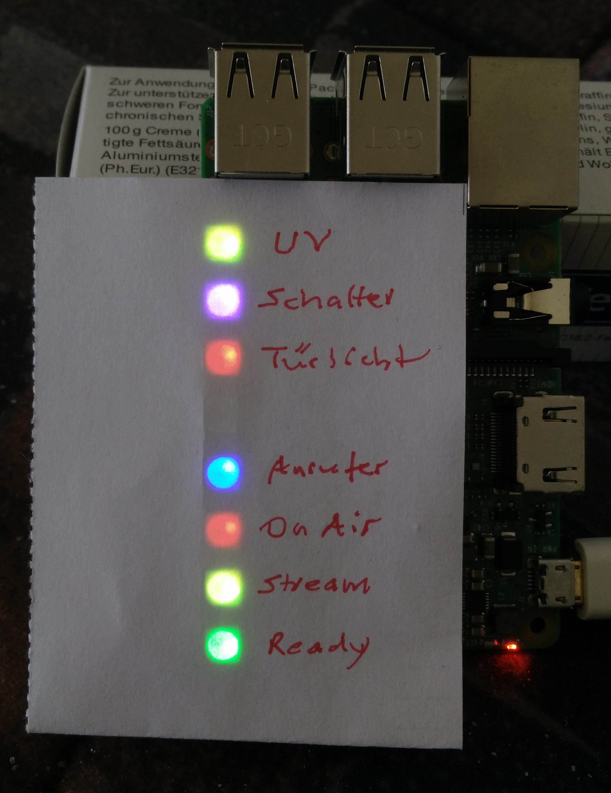
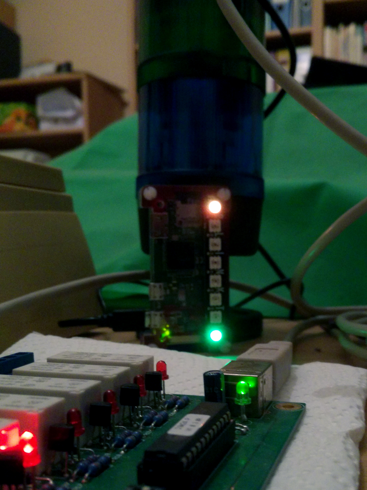

# SignalPi — The poor man’s signal tower

  
*SignalPi on a Raspberry Pi 3B, very early development stage :-)*

We recommend installing the SignalPi module on the main Pi. You can also have a second (third …) one installed on a separate Pi Zero W.

## Table of Contents

<!-- MDTOC maxdepth:6 firsth1:2 numbering:0 flatten:0 bullets:1 updateOnSave:1 -->

- [Table of Contents](#table-of-contents)   
- [Installing on the StudioDisplay Pi](#installing-on-the-studiodisplay-pi)   
   - [Requirements](#requirements)   
   - [Installation](#installation)   
   - [Configuration file](#configuration-file)   
- [Installing on a separate Pi Zero W](#installing-on-a-separate-pi-zero-w)   
   - [Requirements](#requirements)   
   - [Preparing the Pi Zero W](#preparing-the-pi-zero-w)   
   - [Use `ssh` (or `PuTTY`) to connect to your Pi](#use-ssh-or-putty-to-connect-to-your-pi)   
   - [Change the Pi’s hostname and passwords](#change-the-pi’s-hostname-and-passwords)   
      - [Change the hostname](#change-the-hostname)   
      - [Change the user password](#change-the-user-password)   
   - [Copying the software](#copying-the-software)   
   - [Update your Pi’s software](#update-your-pi’s-software)   
   - [Install Python pip](#install-python-pip)   
   - [Install the Python MQTT client software](#install-the-python-mqtt-client-software)   
   - [Configure the MQTT broker to use](#configure-the-mqtt-broker-to-use)   
   - [Configure the SignalPi](#configure-the-signalpi)   
   - [Install the _blinkt!_ library](#install-the-_blinkt_-library)   
   - [Configuration file](#configuration-file)   

<!-- /MDTOC -->

## Installing on the StudioDisplay Pi

### Requirements

* Installed StudioDisplay Pi as described in [docs/install-raspberry-pi.md](install-raspberry-pi.md).

* [Pimoroni’s blinkt! module](https://shop.pimoroni.com/products/blinkt) (a strip of 8 RGB LEDs that can directly be attached to the Pi’s 40-pin GPIO header)

* [Pimoroni’s blinkt! Python library](https://github.com/pimoroni/blinkt) installed

* The following files from our software library (you installed this under `/home/pi/studiodisplay/`) already:

  * `config/studiodisplay1.cfg` (sections `[mqtt]` and [`signalpi`])  
  * `python/signalpi.py`  
  * `python/mqtt-signalpi.py`  

### Installation

Shutdown your Pi, **disconnect the power** and connect the *blinkt!* module. Be sure that all pins are aligned and the *rounded* edges of the blinkt! correspond with the reounded edges of your Pi!

Connect your Pi again and ssh into it.

```bash
ssh pi@studiodisplay1
```

Install [Pimoroni’s blinkt! Python library](https://github.com/pimoroni/blinkt). The easiest way is to use their bash script:

```bash
curl https://get.pimoroni.com/blinkt | bash
```

Follow the instructions and install support for *both* Python 2 and Python 3.

After installation, you might have to reboot your Pi:
```bash
sudo reboot
```

Use ssh to connect again after reboot, and verify that your *blinkt!* is working by trying one or more of their examples:

```bash
cd ~/Pimoroni/blinkt/examples
python rainbow.py
```
You should see a nice scrolling rainbow on your *blinkt!*. End the demo by pressing `Ctrl+C`.

Now let’s verify that the SignalPi software is running correctly. Assuming you haven’t changed anything in the example configuration, the following should work:

Open two termnals. In terminal 1, start the MQTT SignalPi software:

```bash
cd ~/studiodisplay/python/
./mqtt-signalpi.py
```

It should show that a connection has been establisehd. Also, a 3-second *lamp test* is performed, i.e., seven of the eight LEDs should light up for 3 seconds, then go off again.

Now let’s test some studio tower lights that might happen in real life (i.e., when broadcasting). In terminal 2, try the following:

```bash
mosquitto_pub -h studiodisplay1 -t studio/1/status/green -m on
```

The green *Studio Ready* lamp should light up.

Possible values for the lamp topics (-t) are: `studio/1/status/`, followed by `green`, `yellow`, `red`, `blue` and `switch`, respectively.

Possible values for the message (-m) are: `off`, `on`, `flash` and `blink`. (Not all lamps with work with all messages, for instance, you cannot blink or flash the 230V switch.)

You can also set the LED brighness in percent, in 1% steps. The following command would set the brightness to 5%:

```bash
mosquitto_pub -h studiodisplay1 -t signalpi/1/set/brightness -m 5
```

Depending on how you mount your Pi, it might be necessary to reverse the LED sequence:

```bash
mosquitto_pub -h studiodisplay1 -t signalpi/1/set/reversed -m true
```

(You can undo this by sending the message `false`.)

We even included a complete signalling test program:

```bash
cd ~/studiodisplay/python/
./signaltest.py
```

In terminal 1, you should see what signals were received.

Now end the test by pressing `Ctrl+C` in terminal 1 and closing it. Keep terminal 2 open.

Of course you want to automatically start this module whenever your StudioDisplay Pi gets booted up.

So lets add an appropriate entry in *crontab* for this:

```bash
crontab -e
```

Now add (or edit) an entry like this:

```crontab
@reboot sleep 5s && /home/pi/studiodisplay/python/mqtt-signalpi.py
```

Assuming you use *nano* to edit your crontab, now press `Ctrl+O`, `Enter` and `Ctrl+X` to save and exit.

You can verify that everything works correctly by doing a reboot:

```bash
sudo reboot
```

When booting, the lamp test should be performed. SignalPi is now ready to show the signalling going on in your studio.

As per default, it will show the following signals from the other modules (from top to bottom, for easier visualization):

LED | Color | Meaning
--- | --- | ---
7 | various | UV Index (off, green, yellow, orange, red, fuchsia)
6 | fuchsia | State of the 230V switch on the SignalBox
5 | red | 230V ON AIR lamp outside the studio
4 | - | (unused, always off)
3 | blue | Call state (request line)
2 | red | On Air (microphone(s) open)
1 | yellow | Streaming
0 | green | Studio ready

### Configuration file

You can set/modify all relevant options in the `[signalpi]` section of your config file.

As per default, it looks like this:

```ini
[signalpi]
; Requires a Pi with a Pimoroni "blinkt!" module
client_id = signalpi1
; connected, status/, get/, set/, command/ are internally appended to client_topic
; format: device/id/ (id CAN be something else than a number)
client_topic = signalpi/1/
; We subscribe to the studio status topic for displaying its status
subscribe_topic = studio/1/status/
; If you want to show UVI values, set this, otherwise leave blank
; Should return offical UV Index values (0 .. n)
uv_topic = weather/1/status/uv
; Initial blinkt! LED brightness (0 .. 100%)
; The LEDs are REALLY bright, so maybe 10 is enough
brightness = 10
; Due to different mounting, LEDs might have to be in reverse order
; set this to True or False
reversed = True
```

After making changes, you must restart `mqtt-signalpi.py` (or simply reboot your Pi).


## Installing on a separate Pi Zero W

  
*SignalPi on a Raspberry Pi Zero W, next to its »big brother« (a WERMA signal tower); parts of the SignalBox hardware in the foreground. The SignalPi shows »Studio Ready« (green) and an UV index of 6 outside (orange).*


We will assume that you already installed a _blinkt!_ and SignalPI on your main system, the StudioDisplay called `studiodisplay1`. Thus, the number `1` for the first SignalPi is already taken and we will call our new one `signalpi2`.

### Requirements

* A Raspberry Pi Zero W/Zero WH, 4/8/16GB SD card with Raspian Stretch Lite installed and working WLAN connection.

* [Pimoroni’s blinkt! module](https://shop.pimoroni.com/products/blinkt) (a strip of 8 RGB LEDs that can directly be attached to the Pi’s 40-pin GPIO header)

* [Pimoroni’s blinkt! Python library](https://github.com/pimoroni/blinkt) installed

* The following files from our software library:

  * `config/signalpi2.cfg` (sections `[mqtt]` and [`signalpi`])  
  * `python/signalpi.py`  
  * `python/mqtt-signalpi.py`  

### Preparing the Pi Zero W

Download the current _Raspbian Stretch Lite_ from [raspberry.org](https://www.raspberrypi.org/downloads/raspbian/) and unzip the zip file to get the image.

```bash
cd ~/Downloads/
wget https://downloads.raspberrypi.org/raspbian_lite_latest
```

The downloaded file will be called something like `2018-04-18-raspbian-stretch-lite.zip`.

```bash
unzip 2018-04-18-raspbian-stretch-lite.zip
```

This should leave us with a approx. 1.9GB file called something like `2018-04-18-raspbian-stretch-lite.img`.

I suggest you now follow Rasperry Foundation’s [instructions for installing operating system images](https://www.raspberrypi.org/documentation/installation/installing-images/README.md) and their [Configuration Guidelines](https://www.raspberrypi.org/documentation/configuration/) to get your base system up and running.

Personally, I work on Linux and typically use an abbreviated method like the following. **Be careful, if you’re not sure what you’re doing you might destroy all data on your hard drive!**

* Insert the empty SD card into my system, using an adapter card.

* Then use `lsblk` to find the name of my card. This is usually something like `/dev/sdX` or `/dev/mmcblk0`, where `X` is a lower-case letter indicating the device (i.e., `/dev/sdb`).

* Unmount all partitions that the system might have mounted on the card: `umount /dev/sdX1` (replace `sdX1` with your SD card’s device name, and change the number for any other partitions)

* Write the image to the card: `dd bs=4M if=2018-04-18-raspbian-stretch-lite.img of=/dev/sdX conv=fsync` (replace `sdX` with your SD card’s device name).

* Remove and re-insert the card.

* Your system should now auto-mount _two_ partitions on it, called `rootfs` and `boot`.

* Create an empty `ssh` file so the Pi will enable SSH when booting:

  ```bash
  cd /media/$USER/boot/
  touch ssh
  ```

* Create the file `wpa_supplicant.conf` in the card’s `boot` partition so the Pi Zero W will be able to connect to the WLAN:

  ```bash
  nano wpa_supplicant.conf
  ```
* Fill in the following, and correct for your country, SSID and WLAN password:

  ```
  ctrl_interface=DIR=/var/run/wpa_supplicant GROUP=netdev
  update_config=1
  country=DE
  network={
      ssid="YOUR_SSID"
      psk="YOUR_PASSWORD"
      scan_ssid=1
  }
  ```
  Save the file and exit nano.

* You can now sync the changes to the filesystem, unmount the partitions and remove the SD card from your PC:

  ```bash
  sync
  umount /media/$USER/boot
  umount /media/$USER/rootfs
  ```

* Mount the _blinkt!_ on your Pi Zero W, insert the new SD card, connect power and boot it up.


### Use `ssh` (or `PuTTY`) to connect to your Pi

If you are using a fresh installation of Raspbian Lite, connect to your Pi as follows:
```bash
ssh pi@raspberrypi
```
(The default password is `raspberry`, you should change it using `raspi-config`!)

If you have already changed the hostname as suggested, use:
```bash
ssh pi@signalpi2
```
and enter your password when requested to do so.

_Note: Depending on your local network setup, you might have to use a FQDN (Fully Qualified Domain Name) instead of just the hostname. Simple cases might look like `signalpi2.local`, more complicated setups in large companies might even look like `signalpi2.hamburg.studios.bigbroadcastingcompany.com`. Ask your IT admin and just substitute the correct name in the examples._

On Linux, once a system has been set up, you can find its hostname in a terminal like this:

```bash
hostname
```

_Note: The name returned by the `hostname` command is also the name to be used for your StudioDisplay configuration file. So if your hostname was really `signalpi2.hamburg.studios.bigbroadcastingcompany.com`, you would have to call it `signalpi2.hamburg.studios.bigbroadcastingcompany.com.cfg` instead of just `signalpi2.cfg`._


### Change the Pi’s hostname and passwords

On a fresh installation of Raspbian Lite, your Pi will be found in your local network under the hostname `raspberrypi` (you might need to use `raspberrypi.local` for ssh and browser access).

The default username is `pi` and the default password is `raspberry`. This is of course a security risk since everybody knows these.

We want to give our Pi a speaking name like `signalpi2` in the network (you might have more than one and call the next one `signalpi3`) and also change the default passwords to something more secure.

#### Change the hostname

Log into your Pi using SSH. Since this is a fresh installation, the system name is still `raspberrypi` and the user’s password is `raspberry`.

```bash
ssh pi@raspberrypi
```

When connected, use `raspi-config` to change the hostname and other important settings (country, language, timezone, …):

```bash
sudo raspi-config
```

*Note: raspi-config doesn’t support a mouse. You must use the keyboard. Jump between fields using `Tab` (forward) and `Shift+Tab` (backward). `Enter` selects/executes the marked option.*

* Select **2 Network Options** and press `Enter`.
* Select **N1 Hostname** and press `Enter`.
* Read the notice about allowed hostnames and press `Enter`.
* In the input field, change the hostname to **signalpi2** and press `Enter`.
* From the main screen, use the `Tab` key to select **Finish** and press `Enter`.
* When asked **Would you like to reboot now?**, select **Yes** and press `Enter`.

Your Pi will now reboot. Wait a while and then reconnect your SSH session, *using the new hostname `signalpi2`*:

```bash
ssh pi@signalpi2
```

#### Change the user password

Now we go and change the password for the user `pi`:

```bash
passwd
```

You will have to legitimate using the *current* password (which is still `raspberry`) and then enter your *new* password twice.

*Note: On a console, your password input is never echoed, not even as dots or asterisks, so it is normal that you don’t see anything while you type your password.*

*Hint: For security reasons, passwords have to have a minimum length and complexity. If your password is too short or too simple, passwd will let you know.*

If all went well, you’ll get a message that your password has been changed. Remember it well or write it down in a secure place.

Let’s test if all went okay by logging out and back in again:

```bash
logout
ssh pi@signalpi2
```

*Hint: You can also log out from a terminal or SSH session by pressing `Ctrl+D`.*

Use your *new* password this time to log in.


### Copying the software

Copy or `git clone` the software to your home folder on the Pi, into a folder named `studiodisplay`.

Example:
```bash
cd
git clone https://github.com/Moonbase59/studiodisplay.git
cd studiodisplay
```

Make the Python modules in `~/studiodisplay/python` executable:
```bash
cd ~/studiodisplay/python/
chmod +x mqtt-*.py
chmod +x signaltest.py
```

You *must* have a configuration file set up in `~/studiodisplay/config/` that corresponds with your chosen hostname, i.e. `signalpi2`.

For starters, just copy and edit the example configuration file:
```bash
cd ~/studiodisplay/config/
cp example.cfg signalpi2.cfg
```
You can edit this file with `nano`, a very minimalistic commandline editor:
```bash
nano signalpi2.cfg
```
Changes are written with `Ctrl+O` and then pressing `Enter`. Exit nano with `Ctrl+X`.


### Update your Pi’s software

```bash
sudo apt-get update
sudo apt-get dist-upgrade
sudo rpi-update
```

Reboot as neccessary.


### Install Python pip

We might need to install `pip` and `pip3` before we can use it.

```bash
sudo apt-get install python-pip python3-pip
```

### Install the Python MQTT client software

We use Eclipse’s Paho client.

```bash
sudo pip install paho-mqtt
sudo pip3 install paho-mqtt
```

### Configure the MQTT broker to use

Let’s edit the `[mqtt]` section of your config file, `~/studiodisplay/config/signalpi2.cfg`, to let the software modules know which broker to talk to. If you followed my instructions on how to install everything on the StudioDisplay Pi, the broker should run on `studiodisplay1`.

```bash
nano ~/studiodisplay/config/signalpi2.cfg
```

The `[mqtt]` section should look like this:

```ini
[mqtt]
; ALL modules read from this section to find their broker connection data
; For simplicity and energy-saving, we run the MQTT broker
; on the first StudioDisplay (a Raspberry Pi 3B or 3B+).
host = studiodisplay1
port = 1883
websockets_port = 9001
; Base topic to distinguish different users, etc. Can be left empty.
base_topic =
```

### Configure the SignalPi

While we are still editing the configuration file `~/studiodisplay/config/signalpi2.cfg`, let’s set the SignalPi options in the `[signalpi]` section for this system. Remember this one shall be number `2` because we already used number `1` for the main Pi.

```ini
[signalpi]
; Requires a Pi with a Pimoroni "blinkt!" module
client_id = signalpi2
; connected, status/, get/, set/, command/ are internally appended to client_topic
; format: device/id/ (id CAN be something else than a number)
client_topic = signalpi/2/
; We subscribe to the studio status topic for displaying its status
subscribe_topic = studio/1/status/
; If you want to show UVI values, set this, otherwise leave blank
; Should return offical UV Index values (0 .. n)
uv_topic = weather/1/status/uv
; Initial blinkt! LED brightness (0 .. 100%)
; The LEDs are REALLY bright, so maybe 10 is enough
brightness = 10
; Due to different mounting, LEDs might have to be in reverse order
; set this to True or False
reversed = True
```

We renumbered the `client_id` (because it must be unique) and the `client_topic` (because each data provider or device has its own topic on the broker). We didn’t change `subscribe_topic` because we only have one studio, and we didn’t change `uv_topic` because we only have one weather provider.


Now save the file (`Ctrl+O`, `Enter`) and exit the editor (`Ctrl+X`).

### Install the _blinkt!_ library

If you have not already done so, shutdown your Pi, **disconnect the power** and connect the *blinkt!* module. Be sure that all pins are aligned and the *rounded* edges of the blinkt! correspond with the reounded edges of your Pi!

Connect your Pi again and ssh into it.

```bash
ssh pi@signalpi2
```

Install [Pimoroni’s blinkt! Python library](https://github.com/pimoroni/blinkt). The easiest way is to use their bash script:

```bash
curl https://get.pimoroni.com/blinkt | bash
```

Follow the instructions and install support for *both* Python 2 and Python 3.

After installation, you might have to reboot your Pi:
```bash
sudo reboot
```

Use ssh to connect again after reboot, and verify that your *blinkt!* is working by trying one or more of their examples:

```bash
cd ~/Pimoroni/blinkt/examples
python rainbow.py
```
You should see a nice scrolling rainbow on your *blinkt!*. End the demo by pressing `Ctrl+C`.

Now let’s verify that the SignalPi software is running correctly. Assuming you haven’t changed anything in the example configuration, the following should work:

Open two termnals. In terminal 1, start the MQTT SignalPi software:

```bash
cd ~/studiodisplay/python/
./mqtt-signalpi.py
```

It should show that a connection has been establisehd. Also, a 3-second *lamp test* is performed, i.e., seven of the eight LEDs should light up for 3 seconds, then go off again.

Now let’s test some studio tower lights that might happen in real life (i.e., when broadcasting). In terminal 2, try the following:

```bash
mosquitto_pub -h studiodisplay1 -t studio/1/status/green -m on
```

The green *Studio Ready* lamp should light up.

Possible values for the lamp topics (-t) are: `studio/1/status/`, followed by `green`, `yellow`, `red`, `blue` and `switch`, respectively.

Possible values for the message (-m) are: `off`, `on`, `flash` and `blink`. (Not all lamps with work with all messages, for instance, you cannot blink or flash the 230V switch.)

You can also set the LED brighness in percent, in 1% steps. The following command would set the brightness to 5%:

```bash
mosquitto_pub -h studiodisplay1 -t signalpi/2/set/brightness -m 5
```

Depending on how you mount your Pi, it might be necessary to reverse the LED sequence:

```bash
mosquitto_pub -h studiodisplay1 -t signalpi/2/set/reversed -m true
```

(You can undo this by sending the message `false`.)

We even included a complete signalling test program:

```bash
cd ~/studiodisplay/python/
./signaltest.py
```

In terminal 1, you should see what signals were received.

Now end the test by pressing `Ctrl+C` in terminal 1 and closing it. Keep terminal 2 open.

Of course you want to automatically start this module whenever your SignalPi gets booted up.

So lets add an appropriate entry in *crontab* for this:

```bash
crontab -e
```

Now add (or edit) an entry like this:

```crontab
@reboot sleep 5s && /home/pi/studiodisplay/python/mqtt-signalpi.py &
```

Assuming you use *nano* to edit your crontab, now press `Ctrl+O`, `Enter` and `Ctrl+X` to save and exit.

You can verify that everything works correctly by doing a reboot:

```bash
sudo reboot
```

When booting, the lamp test should be performed. SignalPi is now ready to show the signalling going on in your studio.

As per default, it will show the following signals from the other modules (from top to bottom, for easier visualization):

LED | Color | Meaning
--- | --- | ---
7 | various | UV Index (off, green, yellow, orange, red, fuchsia)
6 | fuchsia | State of the 230V switch on the SignalBox
5 | red | 230V ON AIR lamp outside the studio
4 | - | (unused, always off)
3 | blue | Call state (request line)
2 | red | On Air (microphone(s) open)
1 | yellow | Streaming
0 | green | Studio ready

### Configuration file

You can set/modify all relevant options in the `[signalpi]` section of your config file.

As per our changes, it now looks like this:

```ini
[signalpi]
; Requires a Pi with a Pimoroni "blinkt!" module
client_id = signalpi2
; connected, status/, get/, set/, command/ are internally appended to client_topic
; format: device/id/ (id CAN be something else than a number)
client_topic = signalpi/2/
; We subscribe to the studio status topic for displaying its status
subscribe_topic = studio/1/status/
; If you want to show UVI values, set this, otherwise leave blank
; Should return offical UV Index values (0 .. n)
uv_topic = weather/1/status/uv
; Initial blinkt! LED brightness (0 .. 100%)
; The LEDs are REALLY bright, so maybe 10 is enough
brightness = 10
; Due to different mounting, LEDs might have to be in reverse order
; set this to True or False
reversed = True
```

After making changes, you must restart `mqtt-signalpi.py` (or simply reboot your Pi).
