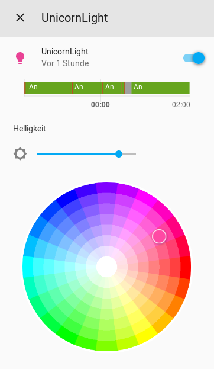
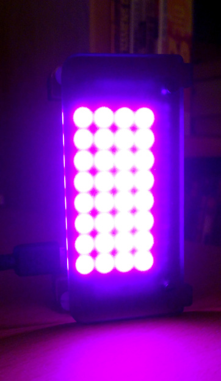

# Install UnicornLight

_TODO: Supply more information_

UnicornLight is an experimental mini »ambient light« (Raspberry Pi Zero W or better and [_Unicorn pHAT_](https://shop.pimoroni.com/products/unicorn-phat) or [_Unicorn HAT_](https://shop.pimoroni.com/products/unicorn-hat) required). It can get its light color information from nearly any MQTT topic, as comma-separated RGB or Kelvin value.

Install on a Raspberry Pi Zero W or better as described in [docs/install-signalpi.md](install-signalpi.md#installing-on-a-separate-pi-zero-w) but instead of the _blinkt!_ library install the [Unicorn HAT Python library](https://github.com/pimoroni/unicorn-hat).

The module to call and/or put into crontab is `~/studiodisplay/python/mqtt-unicornlight.py`.

---

## UnicornLight and Home Assistant

You can easily integrate UnicornLight with [Home Assistant](https://www.home-assistant.io/) using the following code in your `configuration.yaml`:

```yaml
light:
  - platform: mqtt
    name: "UnicornLight"
    state_topic: "unicornlight/1/status/power"
    command_topic: "unicornlight/1/set/power"
    payload_on: "on"
    payload_off: "off"
    rgb_state_topic: "unicornlight/1/status/color"
    rgb_command_topic: "unicornlight/1/set/color"
    brightness_state_topic: "unicornlight/1/status/brightness"
    brightness_command_topic: "unicornlight/1/set/brightness"
    brightness_scale: 100
    availability_topic: "unicornlight/1/connected"
    payload_available: "2"
    payload_not_available: "0"
    qos: 0
    optimistic: false
    retain: false
```

This results in a fully configurable UnicornLight in Home Assistant, which can be automated and used for signalling, illumination or ambient light:




_Hint: If you use UnicornLight with a home automation system, you’ll probably want to use an empty `light_topic` in the configuration file._

UnicornLight _retains_ its status topics on the MQTT broker, so Home Assistant will immediately know its status and availability. Commands sent to a MQTT _command topic_ should _not_ be retained, this is why we set `retain: false` in Home Assistant’s `configuration.yaml`.
